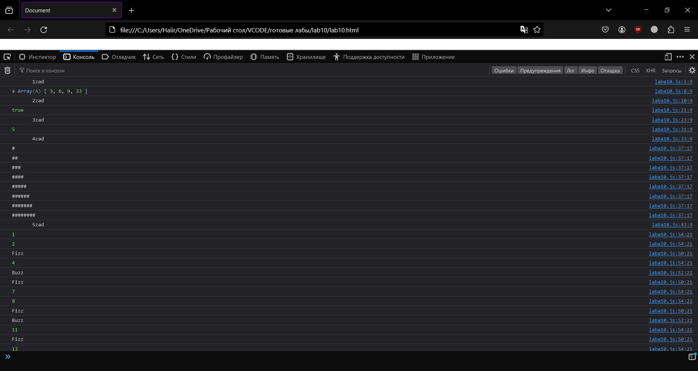
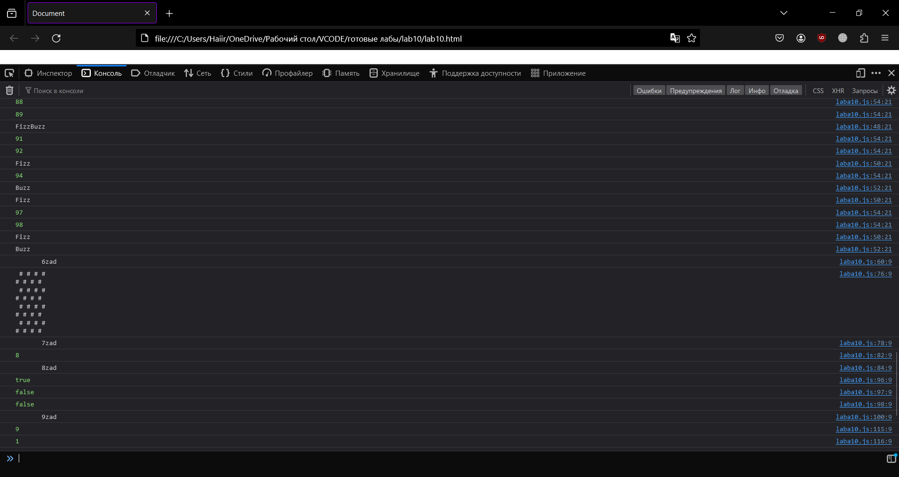
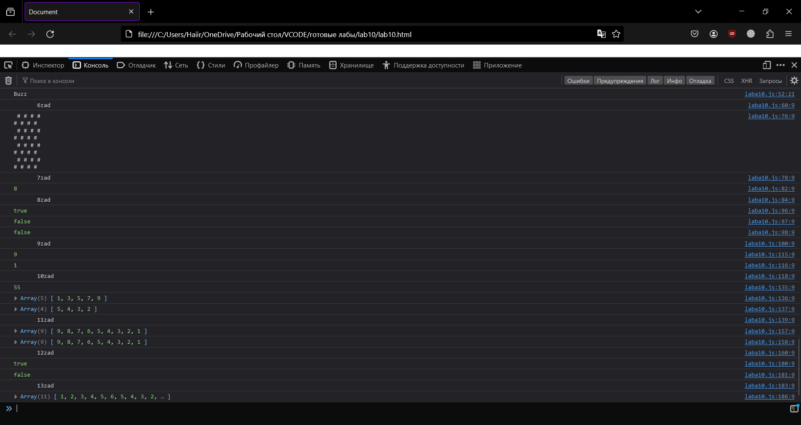

<p align="center">МИНИСТЕРСТВО НАУКИ И ВЫСШЕГО ОБРАЗОВАНИЯ<br>
РОССИЙСКОЙ ФЕДЕРАЦИИ<br> 
ФЕДЕРАЛЬНОЕ ГОСУДАРСТВЕННОЕ БЮДЖЕТНОЕ<br>
ОБРАЗОВАТЕЛЬНОЕ УЧРЕЖДЕНИЕ ВЫСШЕГО ОБРАЗОВАНИЯ<br>
«САХАЛИНСКИЙ ГОСУДАРСТВЕННЫЙ УНИВЕРСИТЕТ»</p>

<br><br><br><br><br>

<p align="center">
Институт естественных наук и техносферной безопасности<br>
Кафедра информатики<br>
Зыков Никита Евгеньевич</p>

<br><br><br>

<p align="center">
Лабораторная работа №10. «JavaScript».<br>
01.03.02 Прикладная математика и информатика</p>

<br><br><br><br><br><br><br><br><br><br>

<p align="right">Научный руководитель<br>
Соболев Евгений Игоревич</p>

<br><br><br>

<p align="center">г. Южно-Сахалинск<br>
2024 г.</p>

<br><br><br><br><br><br><br><br><br><br>

# Введение

<b>HTML</b> — стандартизированный язык гипертекстовой разметки документов для просмотра веб-страниц в браузере. Веб-браузеры получают HTML документ от сервера по протоколам HTTP/HTTPS или открывают с локального диска, далее интерпретируют код в интерфейс, который будет отображаться на экране монитора.

<b>Visual Studio Code</b> — редактор исходного кода, разработанный Microsoft для Windows, Linux и macOS. Позиционируется как «лёгкий» редактор кода для кроссплатформенной разработки веб- и облачных приложений.

# Цели и задачи

1.	Напишите функцию, которая найдёт числа в массиве, которые делятся на заданное число. 
2.	Нужно написать функцию, которая проверяет, являются ли две строки анаграммами, причем регистр букв не имеет значения. Учитываются лишь символы; пробелы или знаки препинания в расчет не берутся.
3.	Нужно написать функцию, принимающую строку в качестве аргумента и возвращающую количество гласных, которые содержатся в строке.
Гласными являются «a», «e», «i», «o», «u».
4.	Треугольник. Напишите цикл,  выводит такой треугольник:
'#
'##
'###
'####
'#####
'######
'#######
5.	FizzBuzz. Напишите программу, которая выводит через console.log все числа от 1 до 100, с двумя исключениями. Для чисел, нацело делящихся на 3, она должна выводить ‘Fizz’, а для чисел, делящихся на 5 (но не на 3) – ‘Buzz’.Когда сумеете – исправьте её так, чтобы она выводила «FizzBuzz» для всех чисел, которые делятся и на 3 и на 5.
6.	Шахматная доска. Напишите программу, создающую строку, содержащую решётку 8х8, в которой линии разделяются символами новой строки. На каждой позиции либо пробел, либо #. 
7.	Минимум. Напишите функцию min, принимающую два аргумента, и возвращающую минимальный из них.
8.	Рекурсия. Ноль чётный. Единица нечётная. У любого числа N чётность такая же, как у N-2. Напишите рекурсивную функцию isEven согласно этим правилам. Она должна принимать число и возвращать булевское значение. Потестируйте её на 50 и 75. Попробуйте задать ей -1. Почему она ведёт себя таким образом? Можно ли её как-то исправить?
9.	Считаем бобы. Символ номер N строки можно получить, добавив к ней .charAt(N) ( “строчка”.charAt(5) ) – схожим образом с получением длины строки при помощи .length. Возвращаемое значение будет строковым, состоящим из одного символа (к примеру, “к”). У первого символа строки позиция 0, что означает, что у последнего символа позиция будет string.length – 1. Другими словами, у строки из двух символов длина 2, а позиции её символов будут 0 и 1.Напишите функцию countBs, которая принимает строку в качестве аргумента, и возвращает количество символов “B”, содержащихся в строке.Затем напишите функцию countChar, которая работает примерно как countBs, только принимает второй параметр — символ, который мы будем искать в строке (вместо того, чтобы просто считать количество символов “B”). Для этого переделайте функцию countBs.
10.	Сумма диапазона.  Напишите функцию range, принимающую два аргумента, начало и конец диапазона, и возвращающую массив, который содержит все числа из него, включая начальное и конечное.Затем напишите функцию sum, принимающую массив чисел и возвращающую их сумму. Запустите указанную выше инструкцию и убедитесь, что она возвращает 55.В качестве бонуса дополните функцию range, чтобы она могла принимать необязательный третий аргумент – шаг для построения массива. Если он не задан, шаг равен единице. Вызов функции range(1, 10, 2) должен будет вернуть [1, 3, 5, 7, 9]. Убедитесь, что она работает с отрицательным шагом так, что вызов range(5, 2, -1) возвращает [5, 4, 3, 2].
11.	Обращаем массив вспять. Напишите две функции, reverseArray и reverseArrayInPlace. Первая получает массив как аргумент и выдаёт новый массив, с обратным порядком элементов. Вторая работает как оригинальный метод reverse – она меняет порядок элементов на обратный в том массиве, который был ей передан в качестве аргумента. Не используйте стандартный метод reverse.
12.	Глубокое сравнение. Оператор == сравнивает переменные объектов, проверяя, ссылаются ли они на один объект. Но иногда полезно было бы сравнить объекты по содержимому. Напишите функцию deepEqual, которая принимает два значения и возвращает true, только если это два одинаковых значения или это объекты, свойства которых имеют одинаковые значения, если их сравнивать рекурсивным вызовом deepEqual. Чтобы узнать, когда сравнивать величины через ===, а когда – объекты по содержимому, используйте оператор typeof. Если он выдаёт “object” для обеих величин, значит нужно делать глубокое сравнение. Не забудьте об одном дурацком исключении, случившемся из-за исторических причин: “typeof null” тоже возвращает “object”.
13.	Свертка. Используйте метод reduce в комбинации с concat для свёртки массива массивов в один массив, у которого есть все элементы входных массивов.


# Решение

Для выполнения этой лабораторной работы, я пользовался:<br>
•	Материалом в сети интернет;
<h2 align = "center">lab10.html</h2>

```html

<!DOCTYPE html>
<html lang="en">
<head>
    <meta charset="UTF-8">
    <meta name="viewport" content="width=device-width, initial-scale=1.0">
    <title>Document</title>
    <style>
        p{
            font-size: 240px;
        }
    </style>
</head>
<body>
    <p>LABA 10</p>
    <script src="laba10.js"></script>
</body>
</html>

```

<h2 align = "center">laba10.js</h2>

```js

console.log("       1zad");

function findDivisibleNumbers(arr, divisor) {
    return arr.filter(num => num % divisor === 0);
}
const numbers = [1, 2, 3, 4, 5, 6, 7, 8, 9, 10, 33, 76];
const divisor = 3;
console.log(findDivisibleNumbers(numbers, divisor)); 

console.log("       2zad");

function areAnagrams(str1, str2) {
    const sanitizeString = function(str) {
        return str.toLowerCase().replace(/[^a-z\d]/g, '').split('').sort().join('');
    }

    return sanitizeString(str1) === sanitizeString(str2);
}
const str1 = "Astronomer ";
const str2 = "moon starer ";
console.log(areAnagrams(str1, str2)); 

console.log("       3zad");

function countVowels(str) {
    const vowels = /[aeiou]/gi;
    const matches = str.match(vowels);
    return matches ? matches.length : 0;
}
const sentence = "aliluia";
console.log(countVowels(sentence)); 

console.log("       4zad");

function printTriangle(height) {
    for (let i = 1; i <= height; i++) {
        console.log("#".repeat(i));
    }
}
const triangleHeight = 8;
printTriangle(triangleHeight);

console.log("       5zad");

function fizzBuzz() {
    for (let i = 1; i <= 100; i++) {
        if (i % 3 === 0 && i % 5 === 0) {
            console.log("FizzBuzz");
        } else if (i % 3 === 0) {
            console.log("Fizz");
        } else if (i % 5 === 0) {
            console.log("Buzz");
        } else {
            console.log(i);
        }
    }
}
fizzBuzz();

console.log("       6zad");
function createChessboard(size) {
    let chessboard = "";
    for (let i = 0; i < size; i++) {
        for (let j = 0; j < size; j++) {
            if ((i + j) % 2 === 0) {
                chessboard += " ";
            } else {
                chessboard += "#";
            }
        }
        chessboard += "\n";
    }
    return chessboard;
}
const size = 8;
console.log(createChessboard(size));

console.log("       7zad");
function min(a, b) {
    return a < b ? a : b;
}
console.log(min(8, 67)); 

console.log("       8zad");
function isEven(n) {
    if (n === 0) {
        return true;
    } else if (n === 1) {
        return false;
    } else if (n < 0) {
        return isEven(-n);
    } else {
        return isEven(n - 2);
    }
}
console.log(isEven(50)); // true
console.log(isEven(75)); // false
console.log(isEven(-1)); // false

console.log("       9zad");
function countBs(str) {
    return countChar(str, 'B');
}
function countChar(str, char) {
    let count = 0;
    for (let i = 0; i < str.length; i++) {
        if (str.charAt(i) === char) {
            count++;
        }
    }
    return count;
}

const testString = "BBBBBBBBBF";
console.log(countBs(testString)); 
console.log(countChar(testString, 'F')); 

console.log("       10zad");
function range(start, end, step = 1) {
    let arr = [];
    if (step > 0) {
        for (let i = start; i <= end; i += step) {
            arr.push(i);
        }
    } else {
        for (let i = start; i >= end; i += step) {
            arr.push(i);
        }
    }
    return arr;
}
function sum(arr) {
    return arr.reduce((total, num) => total + num, 0);
}
console.log(sum(range(1, 10)));      
console.log(range(1, 10, 2));        
console.log(range(5, 2, -1));        

console.log("       11zad");
function reverseArray(arr) {
    let newArr = [];
    for (let i = arr.length - 1; i >= 0; i--) {
        newArr.push(arr[i]);
    }
    return newArr;
}
function reverseArrayInPlace(arr) {
    for (let i = 0; i < Math.floor(arr.length / 2); i++) {
        let temp = arr[i];
        arr[i] = arr[arr.length - 1 - i];
        arr[arr.length - 1 - i] = temp;
    }
    return arr;
}
let array = [1, 2, 3, 4, 5, 6, 7, 8, 9];
//console.log(array);    
console.log(reverseArray(array));            
console.log(reverseArrayInPlace(array));     

console.log("       12zad");
function deepEqual(obj1, obj2) {
    if (obj1 === obj2) return true;

    if (typeof obj1 != 'object' || typeof obj2 != 'object' || obj1 == null || obj2 == null) return false;

    let keys1 = Object.keys(obj1);
    let keys2 = Object.keys(obj2);

    if (keys1.length !== keys2.length) return false;

    for (let key of keys1) {
        if (!keys2.includes(key) || !deepEqual(obj1[key], obj2[key])) return false;
    }

    return true;
}
let obj1 = {a: 1, b: {c: 2}};
let obj2 = {a: 1, b: {c: 2}};
let obj3 = {a: 13, b: {c: 14}};
console.log(deepEqual(obj1, obj2));   
console.log(deepEqual(obj1, obj3));     

console.log("       13zad");
let arrays = [[1, 2, 3], [4, 5], [6], [5,4,3,2,1]];
let flattened = arrays.reduce((accumulator, currentValue) => accumulator.concat(currentValue), []);
console.log(flattened);   

```

# Результат




# Вывод

Была выполнена лабораторная работа №10