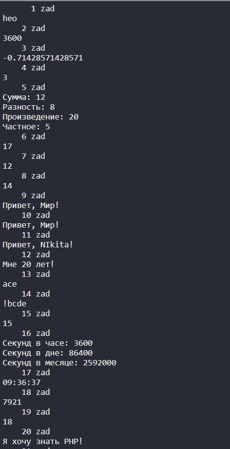
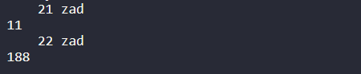

<p align="center">МИНИСТЕРСТВО НАУКИ И ВЫСШЕГО ОБРАЗОВАНИЯ<br>
РОССИЙСКОЙ ФЕДЕРАЦИИ<br> 
ФЕДЕРАЛЬНОЕ ГОСУДАРСТВЕННОЕ БЮДЖЕТНОЕ<br>
ОБРАЗОВАТЕЛЬНОЕ УЧРЕЖДЕНИЕ ВЫСШЕГО ОБРАЗОВАНИЯ<br>
«САХАЛИНСКИЙ ГОСУДАРСТВЕННЫЙ УНИВЕРСИТЕТ»</p>

<br><br><br><br><br>

<p align="center">
Институт естественных наук и техносферной безопасности<br>
Кафедра информатики<br>
Зыков Никита Евгеньевич</p>

<br><br><br>

<p align="center">
Лабораторная работа №11. «PHP».<br>
01.03.02 Прикладная математика и информатика</p>

<br><br><br><br><br><br><br><br><br><br>

<p align="right">Научный руководитель<br>
Соболев Евгений Игоревич</p>

<br><br><br>

<p align="center">г. Южно-Сахалинск<br>
2024 г.</p>

<br><br><br><br><br><br><br><br><br><br>

# Введение

<b>HTML</b> — стандартизированный язык гипертекстовой разметки документов для просмотра веб-страниц в браузере. Веб-браузеры получают HTML документ от сервера по протоколам HTTP/HTTPS или открывают с локального диска, далее интерпретируют код в интерфейс, который будет отображаться на экране монитора.

<b>Visual Studio Code</b> — редактор исходного кода, разработанный Microsoft для Windows, Linux и macOS. Позиционируется как «лёгкий» редактор кода для кроссплатформенной разработки веб- и облачных приложений.

# Цели и задачи

1.	Создайте переменную $var и присвойте ей значение 'hello'. Обращаясь к отдельным символам этой строки выведите на экран символ 'h', символ 'e', символ 'o'.
2.	Напишите скрипт, который считает количество секунд в часе.
3.	Переделайте приведенный код так, чтобы в нем использовались операции +=, -=, *=, /=, ++, --. Количество строк кода при этом не должно измениться. Код для переделки:
<?php
	$var = 1;
	$var = $var + 12;
	$var = $var - 14;
	$var = $var * 5;
	$var = $var / 7;
	$var = $var + 1;
	$var = $var - 1;
	echo $var;
?>
4.	 Создайте переменную $a и присвойте ей значение 3. Выведите значение этой переменной на экран.
5.	Создайте переменные $a=10 и $b=2. Выведите на экран их сумму, разность, произведение и частное (результат деления).
6.	Создайте переменные $c=15 и $d=2. Просуммируйте их, а результат присвойте переменной $result. Выведите на экран значение переменной $result.
7.	Создайте переменные $a=10, $b=2 и $c=5. Выведите на экран их сумму.
8.	 Создайте переменные $a=17 и $b=10. Отнимите от $a переменную $b и результат присвойте переменной $c. Затем создайте переменную $d, присвойте ей значение 7. Сложите переменные $c и $d, а результат запишите в переменную $result. Выведите на экран значение переменной $result.
9.	Создайте переменную $text и присвойте ей значение 'Привет, Мир!'. Выведите значение этой переменной на экран.
10.	 Создайте переменные $text1='Привет, ' и $text2='Мир!'. С помощью этих переменных и операции сложения строк выведите на экран фразу 'Привет, Мир!'.
11.	 Создайте переменную $name и присвойте ей ваше имя. Выведите на экран фразу 'Привет, %Имя%!'. Вместо %Имя% должно стоять ваше имя.
12.	 Создайте переменную $age и присвойте ей ваш возраст. Выведите на экран 'Мне %Возраст% лет!'.
13.	Создайте переменную $text и присвойте ей значение 'abcde'. Обращаясь к отдельным символам этой строки выведите на экран символ 'a', символ 'c', символ 'e'.
14.	 Дана произвольная строка, например, 'abcde'. Поменяйте первую букву (то есть букву 'a') этой строки на '!'.
15.	 Создайте переменную $num и присвойте ей значение '12345'. Найдите сумму цифр этого числа.
16.	Напишите скрипт, который считает количество секунд в часе, в сутках, в месяце.
17.	 Создайте три переменные - час, минута, секунда. С их помощью выведите текущее время в формате 'час:минута:секунда'.
18.	 Создайте переменную, присвойте ей число. Возведите это число в квадрат (это значит нужно умножить его само на себя). Выведите его на экран.
19.	Переделайте этот код так, чтобы в нем использовались операции +=, -=, *=, /=. Количество строк кода при этом не должно измениться.
$var = 47;
$var = $var + 7;
$var = $var - 18;
$var = $var * 10;
$var = $var / 20;
echo $var;
20.	 Переделайте этот код так, чтобы в нем использовалась операция .=. Количество строк кода при этом не должно измениться.
$text = 'Я';
$text = $text.' хочу';
$text = $text.' знать';
$text = $text.' PHP!';
echo $text;
21.	 Переделайте этот код так, чтобы в нем использовались операции ++ и --. Количество строк кода при этом не должно измениться.
$var = 10;
$var = $var + 1;
$var = $var + 1;
$var = $var - 1;
echo $var;
22.	 Переделайте этот код так, чтобы в нем использовались операции ++, -- , +=, -=, *=, /=. Количество строк кода при этом не должно измениться.
$var = 10;
$var = $var + 7;
$var = $var + 1;
$var = $var - 1;
$var = $var + 12;
$var = $var * 7;
$var = $var - 15;
echo $var;


# Решение

Для выполнения этой лабораторной работы, я пользовался:<br>
•	Материалом в сети интернет;
<h2 align = "center">laba11.php</h2>

```php

<?php
        echo "      1 zad\n";  
        $var = 'hello';
        echo $var[0];  
        echo $var[1];  
        echo $var[4]; 

        echo "\n    2 zad\n";  
        $sInHour = 60 * 60;
        echo $sInHour;  

        echo "\n    3 zad\n"; 
        $var = 1;
        $var += 12;
        $var -= 14;
        $var *= 5;
        $var /= 7;
        $var++;
        $var--;
        echo $var;

        echo "\n    4 zad\n"; 
        $a = 3;
        echo $a; 

        echo "\n    5 zad\n"; 
        $a = 10;
        $b = 2;
        $sum =$a + $b;
        $diff = $a - $b;
        $pr= $a * $b;
        $qu = $a / $b;
        echo "Сумма: $sum\nРазность: $diff\nПроизведение: $pr\nЧастное: $qu";
        
        echo "\n    6 zad\n"; 
        $c = 15;
        $d = 2;
        $result = $c + $d;
        echo $result;  

        echo "\n    7 zad\n"; 
        $a = 10;
        $b = 2;
        echo $a + $b;  

        echo "\n    8 zad\n"; 
        $a = 17;
        $b = 10;
        $c =$a - $b;
        $d = 7;
        $result = $c + $d;
        echo $result;  

        echo "\n    9 zad\n"; 
        $text = 'Привет, Мир!';
        echo $text;  

        echo "\n    10 zad\n"; 
        $text1 = 'Привет, ';
        $text2 = 'Мир!';
        $text =$text1 . $text2;
        echo $text;  

        echo "\n    11 zad\n"; 
        $name = 'NIkita';
        echo "Привет, $name!";  

        echo "\n    12 zad\n"; 
        $age = 20;
        echo "Мне $age лет!";  

        echo "\n    13 zad\n"; 
        $text = 'abcde';
        echo $text[0];  
        echo $text[2];  
        echo $text[4];  

        echo "\n    14 zad\n";
        $text = 'abcde';
        $text[0] = '!';
        echo $text;  

        echo "\n    15 zad\n";
        $num = '12345';
        $sum = 0;
        for ($i = 0; $i < strlen($num); $i++) {
            $sum += intval($num[$i]);
        }
        echo $sum;

        echo "\n    16 zad\n";
        $sInHour = 60 * 60;
        $sInDay = $sInHour * 24;
        $sInMonth = $sInDay * 30;
        echo "Секунд в часе: $sInHour\nСекунд в дне: $sInDay\nСекунд в месяце: $sInMonth";

        echo "\n    17 zad\n";
        $hour = date("H");
        $minute = date("i");
        $second = date("s");
        echo "$hour:$minute:$second";  

        echo "\n    18 zad\n";
        $num = 89;
        $num = $num ** 2;
        echo $num;

        echo "\n    19 zad\n";
        $var = 47;
        $var += 7;
        $var -= 18;
        $var *= 10;
        $var /= 20;
        echo $var;

        echo "\n    20 zad\n";
        $text = 'Я';
        $text .= ' хочу';
        $text .= ' знать';
        $text .= ' PHP!';
        echo $text;

        echo "\n    21 zad\n";
        $var = 10;
        $var++;
        $var++;
        $var--;
        echo $var;

        echo "\n    22 zad\n";
        $var = 10;
        $var += 7;
        $var++;
        $var--;
        $var += 12;
        $var *= 7;
        $var -= 15;
        echo $var;
?>
```

# Результат



# Вывод

Была выполнена лабораторная работа №11