<p align="center">МИНИСТЕРСТВО НАУКИ И ВЫСШЕГО ОБРАЗОВАНИЯ<br>
РОССИЙСКОЙ ФЕДЕРАЦИИ<br> 
ФЕДЕРАЛЬНОЕ ГОСУДАРСТВЕННОЕ БЮДЖЕТНОЕ<br>
ОБРАЗОВАТЕЛЬНОЕ УЧРЕЖДЕНИЕ ВЫСШЕГО ОБРАЗОВАНИЯ<br>
«САХАЛИНСКИЙ ГОСУДАРСТВЕННЫЙ УНИВЕРСИТЕТ»</p>

<br><br><br><br><br>

<p align="center">
Институт естественных наук и техносферной безопасности<br>
Кафедра информатики<br>
Зыков Никита Евгеньевич</p>

<br><br><br>

<p align="center">
Лабораторная работа №12. «PHP».<br>
01.03.02 Прикладная математика и информатика</p>

<br><br><br><br><br><br><br><br><br><br>

<p align="right">Научный руководитель<br>
Соболев Евгений Игоревич</p>

<br><br><br>

<p align="center">г. Южно-Сахалинск<br>
2024 г.</p>

<br><br><br><br><br><br><br><br><br><br>

# Введение

<b>HTML</b> — стандартизированный язык гипертекстовой разметки документов для просмотра веб-страниц в браузере. Веб-браузеры получают HTML документ от сервера по протоколам HTTP/HTTPS или открывают с локального диска, далее интерпретируют код в интерфейс, который будет отображаться на экране монитора.

<b>Visual Studio Code</b> — редактор исходного кода, разработанный Microsoft для Windows, Linux и macOS. Позиционируется как «лёгкий» редактор кода для кроссплатформенной разработки веб- и облачных приложений.

# Цели и задачи

1.	Создайте массив, заполненный числами от 1 до 100. Найдите сумму элементов данного массива.
2.	Дан массив с элементами 'a', 'b', 'c', 'd', 'e'. С помощью функции array_map сделайте из него массив 'A', 'B', 'C', 'D', 'E'.
3.	Дан массив $arr. Подсчитайте количество элементов этого массива.
4.	Дан массив $arr. С помощью функции count выведите последний элемент данного массива.
5.	Дан массив с числами. Проверьте, что в нем есть элемент со значением 3.
6.	Дан массив [1, 2, 3, 4, 5]. Найдите сумму элементов данного массива.
7.	Дан массив [1, 2, 3, 4, 5]. Найдите произведение (умножение) элементов данного массива.
8.	Дан массив $arr. С помощью функций array_sum и count найдите среднее арифметическое элементов (сумма элементов делить на их количество) данного массива.
9.	Создайте массив, заполненный числами от 1 до 100.
10.	Создайте массив, заполненный буквами от 'a' до 'z'.
11.	 Создайте строку '1-2-3-4-5-6-7-8-9' не используя цикл.
12.	Найдите сумму чисел от 1 до 100 не используя цикл.
13.	 Найдите произведение чисел от 1 до 10 не используя цикл.
14.	Даны два массива: первый с элементами 1, 2, 3, второй с элементами 'a', 'b', 'c'. Сделайте из них массив с элементами 1, 2, 3, 'a', 'b', 'c'.
15.	Дан массив с элементами 1, 2, 3, 4, 5. С помощью функции array_slice создайте из него массив $result с элементами 2, 3, 4.
16.	Дан массив [1, 2, 3, 4, 5]. С помощью функции array_splice преобразуйте массив в [1, 4, 5].
17.	 Дан массив [1, 2, 3, 4, 5]. С помощью функции array_splice запишите в новый массив элементы [2, 3, 4].
18.	 Дан массив [1, 2, 3, 4, 5]. С помощью функции array_splice сделайте из него массив [1, 2, 3, 'a', 'b', 'c', 4, 5].
19.	 Дан массив [1, 2, 3, 4, 5]. С помощью функции array_splice сделайте из него массив [1, 'a', 'b', 2, 3, 4, 'c', 5, 'e'].
20.	 Дан массив 'a'=>1, 'b'=>2, 'c'=>3'. Запишите в массив $keys ключи из этого массива, а в $values – значения.
21.	 Даны два массива: ['a', 'b', 'c'] и [1, 2, 3]. Создайте с их помощью массив 'a'=>1, 'b'=>2, 'c'=>3'.
22.	Дан массив 'a'=>1, 'b'=>2, 'c'=>3. Поменяйте в нем местами ключи и значения.
23.	 Дан массив с элементами 1, 2, 3, 4, 5. Сделайте из него массив с элементами 5, 4, 3, 2, 1.
24.	Дан массив ['a', '-', 'b', '-', 'c', '-', 'd']. Найдите позицию первого элемента '-'.
25.	 Дан массив ['a', '-', 'b', '-', 'c', '-', 'd']. Найдите позицию первого элемента '-' и удалите его с помощью функции array_splice.
26.	Дан массив ['a', 'b', 'c', 'd', 'e']. Поменяйте элемент с ключом 0 на '!', а элемент с ключом 3 - на '!!'.
27.	Дан массив '3'=>'a', '1'=>'c', '2'=>'e', '4'=>'b'. Попробуйте на нем различные типы сортировок.
28.	Дан массив с элементами 'a'=>1, 'b'=>2, 'c'=>3. Выведите на экран случайный ключ из данного массива.
29.	 Дан массив с элементами 'a'=>1, 'b'=>2, 'c'=>3. Выведите на экран случайный элемент данного массива.
30.	Дан массив $arr. Перемешайте его элементы в случайном порядке.
31.	 Заполните массив числами от 1 до 25 с помощью range, а затем перемешайте его элементы в случайном порядке.
32.	 Создайте массив, заполненный буквами от 'a' до 'z' так, чтобы буквы шли в случайном порядке и не повторялись.
33.	 Сделайте строку длиной 6 символов, состоящую из маленьких английских букв, расположенных в случайном порядке. Буквы не должны повторяться.
34.	Дан массив с элементами 'a', 'b', 'c', 'b', 'a'. Удалите из него повторяющиеся элементы.
35.	Дан массив с элементами 1, 2, 3, 4, 5. Выведите на экран его первый и последний элемент, причем так, чтобы в исходном массиве они исчезли.
36.	 Дан массив с элементами 1, 2, 3, 4, 5. Добавьте ему в начало элемент 0, а в конец - элемент 6.
37.	 Дан массив с элементами 1, 2, 3, 4, 5, 6, 7, 8. С помощью цикла и функций array_shift и array_pop выведите на экран его элементы в следующем порядке: 18273645. 
38.	 Дан массив с элементами 'a', 'b', 'c'. Сделайте из него массив с элементами 'a', 'b', 'c', '-', '-', '-'.
39.	 Заполните массив 10-ю буквами 'x'.
40.	 Создайте массив, заполненный целыми числами от 1 до 20. С помощью функции array_chunk разбейте этот массив на 5 подмассивов ([1, 2, 3, 4]; [5, 6, 7, 8] и т.д.).


# Решение

Для выполнения этой лабораторной работы, я пользовался:<br>
•	Материалом в сети интернет;
<h2 align = "center">laba12.php</h2>

```php

<?php
        echo "      1 zad\n";  
        $nums = range(1, 100);
        $sum = array_sum($nums);
        echo $sum;

        echo "\n    2 zad\n";  
        $letters = ['a', 'b', 'c', 'd', 'e'];
        $cap = array_map('strtoupper', $letters);
        print_r($cap);

        echo "\n    3 zad\n"; 
        $arr = [1,1,1,1,1,1,1,1,1,1,1,1,1];
        $count = count($arr);
        echo $count;

        echo "\n    4 zad\n"; 
        $last = $arr[count($arr)-1];
        echo $last;

        echo "\n    5 zad\n"; 
        $numbers = [1, 2, 3, 4, 5];
        if (in_array(3, $numbers)) {
            echo 'yes';
        } else {
            echo 'not';
        }
        
        echo "\n    6 zad\n"; 
        $n = [1, 2, 3, 4, 5];
        $sum = array_sum($n);
        echo $sum;

        echo "\n    7 zad\n"; 
        $n = [1, 2, 3, 4, 5];
        $p = array_product($n);
        echo $p;

        echo "\n    8 zad\n"; 
        $av = array_sum($arr) / count($arr);
        echo $av;

        echo "\n    9 zad\n"; 
        $arr = range(1, 100);
        print_r($arr);

        echo "\n    10 zad\n"; 
        $arr = range('a', 'z');
        print_r($arr);

        echo "\n    11 zad\n"; 
        $s = implode('-', range(1, 9));
        echo $s;

        echo "\n    12 zad\n"; 
        $sum = array_sum(range(1, 100));
        echo $sum;

        echo "\n    13 zad\n"; 
        $pr = array_product(range(1, 10));
        echo $pr;

        echo "\n    14 zad\n";
        $arr1 = [1, 2, 3];
        $arr2 = ['a', 'b', 'c'];
        $arr12 = array_merge($arr1, $arr2);
        print_r($arr12);

        echo "\n    15 zad\n";
        $arr = [1, 2, 3, 4, 5];
        $res = array_slice($arr, 1, 3);
        print_r($res);

        echo "\n    16 zad\n";
        $arr = [1, 2, 3, 4, 5];
        array_splice($arr, 1, 2);
        print_r($arr);

        echo "\n    17 zad\n";
        $arr = [1, 2, 3, 4, 5];
        $new_arr = array_splice($arr, 1, 3);
        print_r($new_arr);

        echo "\n    18 zad\n";
        $arr = [1, 2, 3, 4, 5];
        array_splice($arr, 3, 0, ['a', 'b', 'c']);
        print_r($arr);

        echo "\n    19 zad\n";
        $arr = [1, 2, 3, 4, 5];
        array_splice($arr, 1, 0, ['a', 'b']);
        array_splice($arr, 5, 0, ['c']);
        array_splice($arr, 8, 0, ['e']);
        print_r($arr);

        echo "\n    20 zad\n";
        $arr = ['a' => 1, 'b' => 2, 'c' => 3];
        $keys = array_keys($arr);
        $values = array_values($arr);
        print_r($keys);
        print_r($values);

        echo "\n    21 zad\n";
        $keys = ['a', 'b', 'c'];
        $values = [1, 2, 3];
        $new_arr = array_combine($keys, $values);
        print_r($new_arr);

        echo "\n    22 zad\n";
        $arr = ['a' => 1, 'b' => 2, 'c' => 3];
        $arr = array_flip($arr);
        print_r($arr);

        echo "\n    23 zad\n";
        $arr = [1, 2, 3, 4, 5];
        $rev_arr = array_reverse($arr);
        print_r($rev_arr);

        echo "\n    24 zad\n";
        $arr = ['a', '-', 'b', '-', 'c', '-', 'd'];
        $pos = array_search('-', $arr);
        echo $pos;

        echo "\n    25 zad\n";
        $arr = ['a', '-', 'b', '-', 'c', '-', 'd'];
        $pos = array_search('-', $arr);
        if ($pos != false) {
            array_splice($arr, $pos, 1);
        }
        print_r($arr);

        echo "\n    26 zad\n";
        $arr = ['a', 'b', 'c', 'd', 'e'];
        $arr[0] = '!';
        $arr[3] = '!!';
        print_r($arr);

        echo "\n    27 zad\n";
        $arr = ['3' => 'a', '1' => 'c', '2' => 'e', '4' => 'b'];
        echo "Сортировка по ключам в возрастающем порядке\n";
        ksort($arr);
        print_r($arr);
        echo "\nСортировка по ключам в убывающем порядке\n";
        krsort($arr);
        print_r($arr);
        echo "Сортировка по значениям в возрастающем порядке\n";
        asort($arr);
        print_r($arr);
        echo "\nСортировка по значениям в убывающем порядке\n";
        arsort($arr);
        print_r($arr);

        echo "\n    28 zad\n";
        $arr = ['a' => 1, 'b' => 2, 'c' => 3];
        $ran_key = array_rand($arr);
        echo $ran_key;

        echo "\n    29 zad\n";
        $arr = ['a' => 1, 'b' => 2, 'c' => 3];
        $ran_el = $arr[array_rand($arr)];
        echo $ran_el;

        echo "\n    30 zad\n";
        $arr = [1,11,14,144,133,190,122,1000,551,221,1351,331,5531];
        shuffle($arr);
        print_r($arr);

        echo "\n    31 zad\n";
        $arr = range(1, 25);
        shuffle($arr);
        print_r($arr);

        echo "\n    32 zad\n";
        $arr = range('a', 'z');
        shuffle($arr);
        print_r($arr);

        echo "\n    33 zad\n";
        $arr = range('a', 'z');
        shuffle($arr);
        $s = implode('', array_slice($arr, 0, 6));
        echo $s;

        echo "\n    34 zad\n";
        $arr = ['a', 'b', 'c', 'b', 'a'];
        $uarr = array_unique($arr);
        print_r($uarr);

        echo "\n    35 zad\n";
        $arr = [1, 2, 3, 4, 5];
        $first_el = array_shift($arr);
        $last_el = array_pop($arr);
        echo $first_el . '    ' . $last_el;

        echo "\n    36 zad\n";
        $arr = [1, 2, 3, 4, 5];
        array_unshift($arr, 0);
        array_push($arr, 6);
        print_r($arr);

        echo "\n    37 zad\n";
        $arr = [1, 2, 3, 4, 5, 6, 7, 8];
        $res = '';
        while (!empty($arr)) {
            $res .= array_shift($arr) . array_pop($arr);
        }
        echo $res;

        echo "\n    38 zad\n";
        $arr = ['a', 'b', 'c'];
        $ara_ara = array_merge($arr, array_fill(0, 3, '-'));
        print_r($ara_ara);

        echo "\n    39 zad\n";
        $arr = array_fill(0, 10, 'x');
        print_r($arr);

        echo "\n    40 zad\n";
        $arr = range(1, 20);
        $sub_arr = array_chunk($arr, 4);
        print_r($sub_arr);
?>
```

# Результат
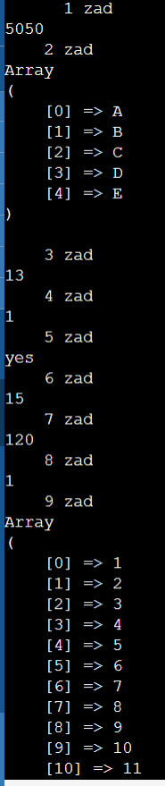
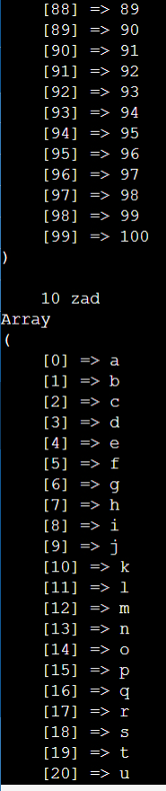
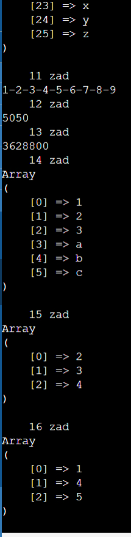
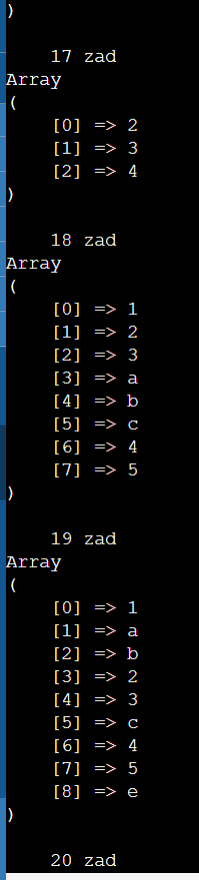
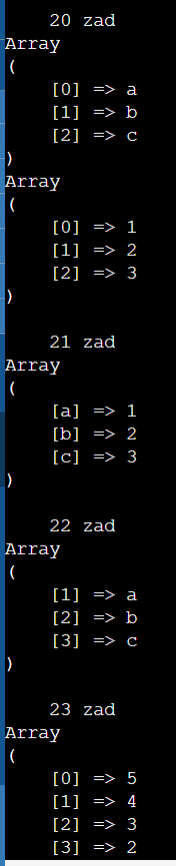
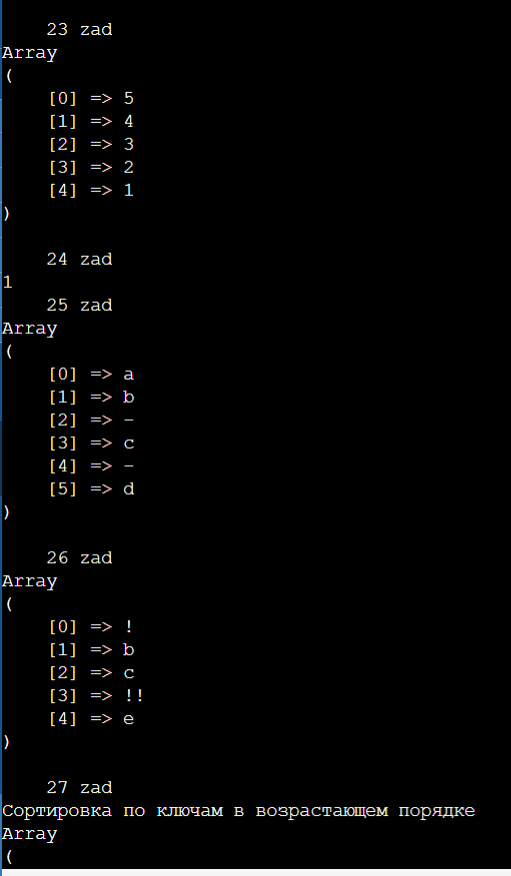
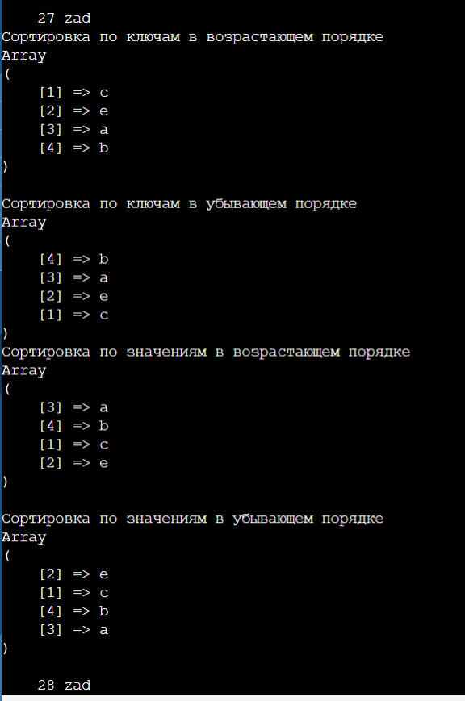
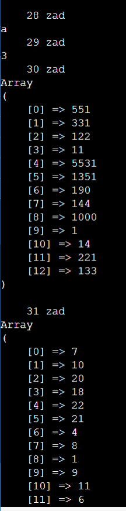
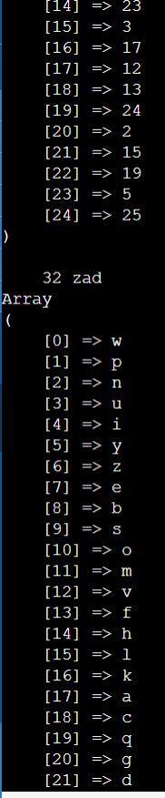
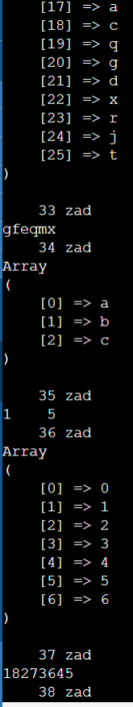
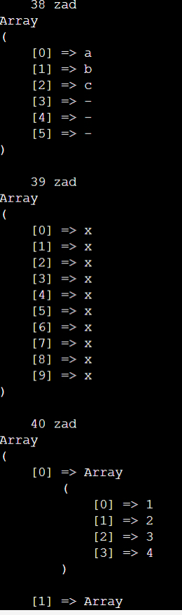
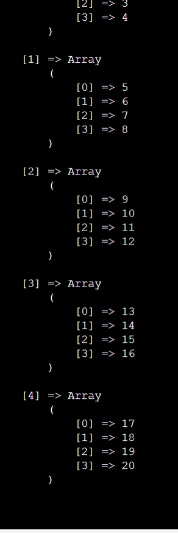

# Вывод

Была выполнена лабораторная работа №12