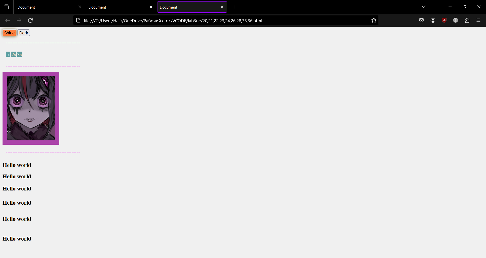

<p align="center">МИНИСТЕРСТВО НАУКИ И ВЫСШЕГО ОБРАЗОВАНИЯ<br>
РОССИЙСКОЙ ФЕДЕРАЦИИ<br> 
ФЕДЕРАЛЬНОЕ ГОСУДАРСТВЕННОЕ БЮДЖЕТНОЕ<br>
ОБРАЗОВАТЕЛЬНОЕ УЧРЕЖДЕНИЕ ВЫСШЕГО ОБРАЗОВАНИЯ<br>
«САХАЛИНСКИЙ ГОСУДАРСТВЕННЫЙ УНИВЕРСИТЕТ»</p>

<br><br><br><br><br>

<p align="center">
Институт естественных наук и техносферной безопасности<br>
Кафедра информатики<br>
Зыков Никита Евгеньевич</p>

<br><br><br>

<p align="center">
Лабораторная работа №2. «HTML».<br>
01.03.02 Прикладная математика и информатика</p>

<br><br><br><br><br><br><br><br><br><br>

<p align="right">Научный руководитель<br>
Соболев Евгений Игоревич</p>

<br><br><br>

<p align="center">г. Южно-Сахалинск<br>
2024 г.</p>

<br><br><br><br><br><br><br><br><br><br>

# Введение

<b>HTML</b> — стандартизированный язык гипертекстовой разметки документов для просмотра веб-страниц в браузере. Веб-браузеры получают HTML документ от сервера по протоколам HTTP/HTTPS или открывают с локального диска, далее интерпретируют код в интерфейс, который будет отображаться на экране монитора.

<b>Visual Studio Code</b> — редактор исходного кода, разработанный Microsoft для Windows, Linux и macOS. Позиционируется как «лёгкий» редактор кода для кроссплатформенной разработки веб- и облачных приложений.

# Цели и задачи

Задачи:
1. Создать все виды заголовков с текстом "Hello world" c классом "heading". 
2. Каждому заголовку также дать id (к прим. heading-1, heading-2...) 
3. Задать всем заголовкам цвет текста на красный 
4. Второму заголовку синий 
5. Третьему заголовку поменять задний фон на чёрный 
6. Четвертому заголовку сделать border и округлить углы 
7. Пятому заголовку создать :hover эффект (любой) 
8. Создайте 6 input с разными типами. 
9. Создать нумерованный список из 4 элементов с текстом “Нумерованный”. 
10. Создать маркированный список из 4 элементов с текстом “Маркированный” и квадратным маркером. 
11. Создайте веб-страницу с зеленым фоном и белым текстом из 30 слов. 
12. Создать 6 блоков с нумерацией и такими параметрами (ширина 100px и высота 100px, зеленого цвета , внешним отступом 10px). Их родительским элементом должен быть container. 
13. Поставить все блоки по центру страницы. 
14. Добавьте тэг iframe на вашу страницу.
15. Сделайте простую форму регистрации на сайте (Только верстка).
16. Сделайте таблицу на странице.
17. Создайте стиль для заголовка h1 с красным цветом текста.
18. Установите шрифт Arial для всех параграфов на странице.
19. Добавьте тень на блок div с помощью свойства box-shadow.
20. Установите фоновый цвет #f0f0f0 для всего документа.
21. Создайте анимацию, которая будет мигать красным цветом.
22. Установите отступы внутри блока div с помощью свойства padding.
23. Создайте стиль для ссылок, которые будут менять цвет при наведении на них курсора.
24. Добавьте границу вокруг изображения с помощью свойства border.
25. Создайте стиль для списка ul с маркерами в виде квадратов.
26. Установите ширину и высоту блока div с помощью свойств width и height.
27. Создайте стиль для таблицы, который будет делать каждую вторую строку серой.
28. Добавьте эффект перехода при наведении на кнопку с помощью свойства transition.
29. Установите фоновое изображение для элемента с помощью свойства background-image.
30. Создайте стиль для формы с полями для ввода текста и кнопкой отправки.
31. Добавьте рамку вокруг текстового поля с помощью свойства outline.
32. Установите выравнивание текста по центру в блоке div с помощью свойства text-align.
33. Создайте стиль для выпадающего меню с помощью псевдоэлемента :hover.
34. Добавьте тень на текст с помощью свойства text-shadow.
35. Создайте стиль для анимации появления элемента на странице с помощью свойства opacity.
36. Установите шрифт размером 18 пикселей для всех заголовков на странице.


# Решение

Для выполнения этой лабораторной работы, я пользовался:<br>
•	Материалом в сети интернет;

<h2 align = "center">Файл 1-10,17,25.html</h2>

```html
<!DOCTYPE html>
<html lang="en">
<head>
    <meta charset="UTF-8">
    <meta name="viewport" content="width=device-width, initial-scale=1.0">
    <title>Document</title>
    <style>
        
        heading *{
            color: red;
        }
        #heading-1{
            color:red;
            font-family: 'Gill Sans', 'Gill Sans MT', Calibri, 'Trebuchet MS', sans-serif;
        }
        #heading-2{
            color: blue;
        }
        #heading-3{
            background-color: black;
        }
        #heading-4{
            border: 3px solid rgb(37, 88, 71);
            border-radius: 35%;
        }
        #heading-5:hover{
            background: #593c12; 
            color: #ffe; 
            text-align: center;
        }
    </style>
</head>
<body>
    <heading>
        <h1 id="heading-1">Hello world</h1>
        <h2 id="heading-2">Hello world</h2>
        <h3 id="heading-3">Hello world</h3>
        <h4 id="heading-4">Hello world</h4>
        <h5 id="heading-5">Hello world</h5>
        <h6 id="heading-6">Hello world</h6>
    </heading>
    <input type="submit" value="послать на">
    <input type="text"><br>
    <input type="button" value="df"><br>
    <input type="radio" name="browser" value="firefox"> qwerty<br>
    <input type="datetime-local"><br>
    <input type="date"><br>
    <ul style="list-style-type: decimal;">
        <li>Нумерованный</li>
        <li>Нумерованный</li>
        <li>Нумерованный</li>
        <li>Нумерованный</li>
    </ul>
    <ul style="list-style-type:square">
        <li>Маркированный</li>
        <li>Маркированный</li>
        <li>Маркированный</li>
        <li>Маркированный</li>
    </ul>
    
</body>
</html>
```
<h2 align = "center">Файл 11,18,19,32,34.html</h2>

```html
<!DOCTYPE html>
<html lang="en">
<head>
    <meta charset="UTF-8">
    <meta name="viewport" content="width=device-width, initial-scale=1.0">
    <title>Document</title>
    <style>
        html{
            background-color: green;
            
        }
        div{
            color: white;
            font-family: "Arial";
            
            text-align: center;
            text-shadow: 30px 12px 3px #272424;
        }
        #div1{
            box-shadow: 3px 7px 10px rgb(68, 175, 56);
        }
    </style>
</head>
<body>
    <!--<div>Ваш Декольтированный Опус Отгладиться Отчихвостить Пароконный Подпольный Порозоветь Разлечься Шерстистый Граница Занизить Зардеться Кожура Лежкий Наутро Первосортный Постриг Рассредоточить Уставиться Безмолвие Вращать Инерция Крупноплодный Литейщик Мадьярский Обитель Самодержец Санитария Чем</div>-->
    <div id="div1">Соображения высшего порядка, а также постоянное информационно-техническое обеспечение нашей деятельности требует определения и уточнения модели развития!</div>
    <div>Значимость этих проблем настолько очевидна, что постоянное информационно-техническое обеспечение нашей деятельности играет важную роль</div>
</body>
</html>
```
<h2 align = "center">Файл 12,13,29.html</h2>

```html
<!DOCTYPE html>
<html lang="en">
<head>
    <meta charset="UTF-8">
    <meta name="viewport" content="width=device-width, initial-scale=1.0">
    <title>Document</title>
    <style>
        p{
            width: 100px;
            height: 100px;
            background-color: green;
            margin: 10px;
            
        }
        .container{
            color: aliceblue;
            text-align: center;
        }
        body {
            display: flex;
            align-items: center;
            justify-content: center;
        }
        html{
            background-image: url(IMG_0794.PNG);
            background-repeat: repeat-x;
            
        }

    </style>
</head>
<body>
    
    <div class="container">
        <p>1</p>
        <p>2</p>
        <p>3</p>
        <p>4</p>
        <p>5</p>
        <p>6</p>
    </div>
        
</body>
</html>
```
<h2 align = "center">Файл 14.html</h2>

```html
<!DOCTYPE html>
<html lang="en">
<head>
    <meta charset="UTF-8">
    <meta name="viewport" content="width=device-width, initial-scale=1.0">
    <title>Document</title>
</head>
<body>
    <iframe src="https://www.google.com/maps/embed?pb=!1m18!1m12!1m3!1d12923.338232128239!2d139.5014941010232!3d35.92654937380563!2m3!1f0!2f0!3f0!3m2!1i1024!2i768!4f13.1!3m3!1m2!1s0x6018dbf0c9d5e2ff%3A0x2e3ecba4d6419842!2z5bCP5rGf5oi45rip5rOJIEtBU0hJQkE!5e0!3m2!1sru!2sru!4v1710324859546!5m2!1sru!2sru" width="800" height="650" style="border:0;" allowfullscreen="" loading="lazy" referrerpolicy="no-referrer-when-downgrade"></iframe>
</body>
</html>
```
<h2 align = "center">Файл 15.html</h2>
```html
<!DOCTYPE html>
<html lang="en">
<head>
    <meta charset="UTF-8">
    <meta name="viewport" content="width=device-width, initial-scale=1.0">
    <title>Document</title>
</head>
<body>
    <h2>Регистрация</h2>

<form method="post">
  <label for="username">Имя пользователя:</label><br>
  <input type="text" id="username" name="username" required><br><br>

  <label for="email">Email:</label><br>
  <input type="email" id="email" name="email" required><br><br>

  <label for="password">Пароль (минимум 8 символов, должен содержать хотя бы одну цифру и одну букву в верхнем регистре):</label><br>
  <input type="password" id="password" name="password" required pattern="(?=.*\d)(?=.*[A-Z]).{8,}" title="Пароль должен содержать не менее 8 символов, хотя бы одну цифру и одну букву в верхнем регистре"><br><br>
  
  <input type="submit" value="Зарегистрироваться">
</form>
</body>
</html>
```
<h2 align = "center">Файл 16,27.html</h2>

```html
<!DOCTYPE html>
<html lang="en">
<head>
    <meta charset="UTF-8">
    <meta name="viewport" content="width=device-width, initial-scale=1.0">
    <title>Document</title>
    <link rel="stylesheet" href="Style2.css">
</head>
<body>
    <table>
        <thead>
          <tr>
            <th scope="row">Название</th>
            <th scope="row">Цена</th>
            <th scope="row">Описание</th>
          </tr>
        </thead>
        <tbody>
          <tr>
            <td>Сандалии Джобса</td>
            <td>$218,7 тыс.</td>
            <td>Коричневые замшевые сандалии марки Birkenstock, которые в 1970–1980-х гг. носил основатель Apple Стив Джобс</td>
          </tr>
          <tr>
            <td>Джинсы XIX века</td>
            <td>$87,4 тыс.</td>
            <td>Пара джинсов бренда Levi&#x27;s 1880 г., была найдена в заброшенной шахте</td>
          </tr>
          <tr>
            <td>Последнее письмо Леннона</td>
            <td>$63,8 тыс.</td>
            <td>Письмо участника группы Beatles Джона Леннона, написанное за несколько часов до его смерти</td>
          </tr>
          <tr>
            <td>Первый </strong>iPhone<strong></td>
            <td>$35,4 тыс.</td>
            <td>О том, что эта модель — одна из самых старых, говорит изображение на коробке iPhone: на ней изображено устройство с 12 иконками, а тринадцатая иконка — iTunes — появилась в конце 2007 г.</td>
          </tr>
        </tbody>
      </table>
</body>
</html>
```
<h2 align = "center">Файл 20,21,22,23,24,26,28,35,36.html</h2>

```html
<!DOCTYPE html>
<html lang="en">
<head>
    <meta charset="UTF-8">
    <meta name="viewport" content="width=device-width, initial-scale=1.0">
    <title>Document</title>
    <style>
        body{
            background-color: #f0f0f0;
        }
        .button{
            background-color: rgb(207, 132, 132);
            animation: glowing 1000ms infinite;
            color: white;
           
        }
        .button1{
            transition: background-color 0.3s, color 0.3s;
        }
        .button2{
            transition: background-color 0.3s, color 0.3s;
            opacity: 0;
        }
        @keyframes glowing{
            0% {background-color: rgb(255, 0, 0); box-shadow: 0 0 3px #b27a00;}
            25% {background-color: rgb(255, 253, 127);box-shadow: 0 0 15px #263d42;color: black;}
            75% {background-color: rgb(255, 0, 0);box-shadow: 0 0 3px #b27a00;}
            100% {background-color: rgb(255, 120, 120);box-shadow: 0 0 15px #263d42;color: black;}
        }
        a{
            color:antiquewhite;
            background-color: cadetblue;
        }
        a:hover{
            color: #000;
            background-color: aliceblue;
        }
        .button1:hover {
            background-color: rgb(68, 27, 77);
            color: white;
           
        }
        .button2:hover {
            background-color: rgb(217, 163, 230);
            color: rgb(22, 22, 22);
            opacity: 1;
            transition: 2s;
           
        }
        div{
            padding: 10px;
            color:violet
        }
        heading *{
            font-size: 18px;
        }
        img{
            width: 10%;
            border: 14px solid rgb(171, 68, 169);
        }
    </style>
</head>
<body>
    <!--<a class="button" href="#"-->
    <button type="submit" class="button">Shine</button>
    <button type="submit" class="button1">Dark</button>
    <button type="submit" class="button2">Hide</button>
    <div>--------------------------------------------</div>
    <div style="width: 60px; height: 17px;">
        <a class="button3" href="#1s">1s</a>
        <a class="button3" href="#2s">2s</a>
        <a class="button3" href="#3s">3s</a>
    </div>
    <div>--------------------------------------------</div>
    
    <div>--------------------------------------------</div>
    <heading>
        <h1>Hello world</h1>
        <h2>Hello world</h2>
        <h3>Hello world</h3>
        <h4>Hello world</h4>
        <h5>Hello world</h5>
        <h6>Hello world</h6>
    </heading>
    
</body>
</html>
```
<h2 align = "center">Файл 30,31.html</h2>

```html
<!DOCTYPE html>
<html lang="en">
<head>
    <meta charset="UTF-8">
    <meta name="viewport" content="width=device-width, initial-scale=1.0">
    <title>Document</title>
    <style>
        #text1 {
            outline: 2px dotted blueviolet;
        }
    </style>
    
</head>
<body>
    <form action="/" method="post">
        <fieldset>
            <legend>Форма для отзыва</legend>
            <label id="text1">Имя: <input type="text" placeholder="Имя" required></input></label>
            <label>email: <input type="email" placeholder="email" required></input></label>
            <label>Текст сообщения: </label>
            <label><textarea placeholder="Введите сообщение" required></textarea></label>
            <label><button type="submit">Отправить</button></label>
        </fieldset>
    </form>
</body>
</html>
```
<h2 align = "center">Файл 33.html</h2>

```html
<!DOCTYPE html>
<html lang="en">
<head>
    <meta charset="UTF-8">
    <meta name="viewport" content="width=device-width, initial-scale=1.0">
    <title>Document</title>
    <link rel="stylesheet" href="Style3.css">
</head>
<body>
    <div class="navbar">
        <a href="#home">HOME</a>
        <div class="dropdown">
          <button class="dropbtn" style="color: #ffffff;">Выпадающее меню
            <i class="fa fa-caret-down"></i>
          </button>
          <div class="dropdown-content">
            <a href="#1S">Ссылка 1</a>
            <a href="#2S">Ссылка 2</a>
            <a href="#3S">Ссылка 3</a>
          </div>
        </div>
        <a href="#news">Новости</a>
      </div> 
</body>
</html>
```

# Результат





# Вывод

Была выполнена лабораторная работа №3
