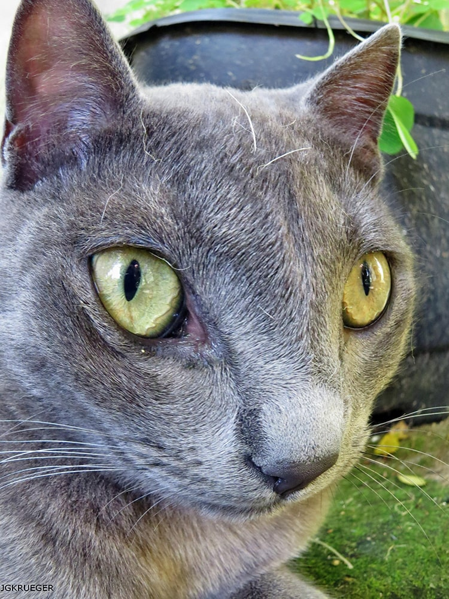
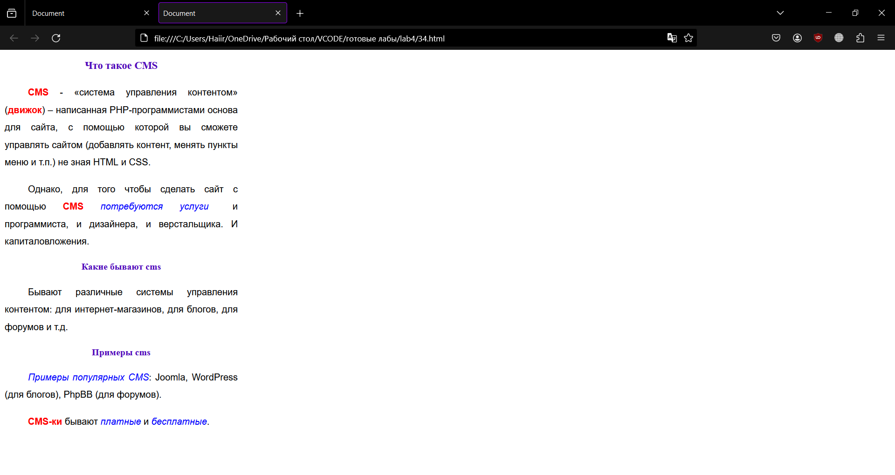
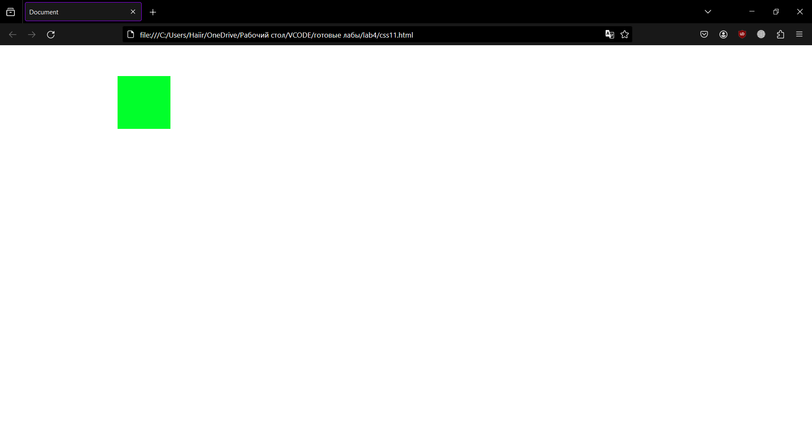

<p align="center">МИНИСТЕРСТВО НАУКИ И ВЫСШЕГО ОБРАЗОВАНИЯ<br>
РОССИЙСКОЙ ФЕДЕРАЦИИ<br> 
ФЕДЕРАЛЬНОЕ ГОСУДАРСТВЕННОЕ БЮДЖЕТНОЕ<br>
ОБРАЗОВАТЕЛЬНОЕ УЧРЕЖДЕНИЕ ВЫСШЕГО ОБРАЗОВАНИЯ<br>
«САХАЛИНСКИЙ ГОСУДАРСТВЕННЫЙ УНИВЕРСИТЕТ»</p>

<br><br><br><br><br>

<p align="center">
Институт естественных наук и техносферной безопасности<br>
Кафедра информатики<br>
Зыков Никита Евгеньевич</p>

<br><br><br>

<p align="center">
Лабораторная работа №4. «HTML».<br>
01.03.02 Прикладная математика и информатика</p>

<br><br><br><br><br><br><br><br><br><br>

<p align="right">Научный руководитель<br>
Соболев Евгений Игоревич</p>

<br><br><br>

<p align="center">г. Южно-Сахалинск<br>
2024 г.</p>

<br><br><br><br><br><br><br><br><br><br>

# Введение

<b>HTML</b> — стандартизированный язык гипертекстовой разметки документов для просмотра веб-страниц в браузере. Веб-браузеры получают HTML документ от сервера по протоколам HTTP/HTTPS или открывают с локального диска, далее интерпретируют код в интерфейс, который будет отображаться на экране монитора.

<b>Visual Studio Code</b> — редактор исходного кода, разработанный Microsoft для Windows, Linux и macOS. Позиционируется как «лёгкий» редактор кода для кроссплатформенной разработки веб- и облачных приложений.

# Цели и задачи

1.	Используйте 3 способа подключения CSS.
2.	Сделайте все абзацы p> красного цвета.
3.	 Сделайте все h1> зеленого цвета.
4.	 Сделайте все h2> голубого цвета.
5.	 Сделайте все h3> оранжевого цвета.
6.	Сделайте первый на странице абзац p> зеленого цвета.
7.	 Сделайте второй на странице абзац p> красного цвета.
8.	Сделайте все абзацы h2> шириной 300px.
9.	 Сделайте все таблицы table> шириной 400px, высотой 200px.
10.	Поставьте все h1> по центру.
11.	 Поставьте все h2> по правому краю.
12.	 Сделайте так, чтобы текст в абзацах p> был выровнен одновременно и по правому и по левому краю.
13.	 Сделайте так, чтобы во втором абзаце p> текст был выровнен по центру.
14.	 Поставьте все th> по левому краю.
15.	 Поставьте все td> по центру.
16.	Сделайте все td> жирным.
17.	 Сделайте h1> нежирным.
18.	 Сделайте одновременно th>, h1> и h2> нежирным.

19.	Сделайте все h2> курсивом.
20.	 Сделайте все абзацы p> курсивом, а первый абзац - нет.
21.	Сделайте все h2> 20px.
22.	 Сделайте все абзацы p> 15px.
23.	Сделайте для абзацев p> шрифт Arial.
24.	 Сделайте для h2> шрифт Times New Roman.
25.	 Сделайте для h3> любой шрифт без засечек.
26.	Сделайте межстрочный интервал для абзацев p> в 30px.
27.	Закомментируйте некоторые стили для абзацев.
28.	 Для p> сделайте шрифт Arial, 16 пикселей, курсив, жирный, межстрочный интервал в 30px.
29.	 Для h1> сделайте следующий шрифт: нежирный, 20 пикселей, Verdana.
30.	Сделайте красную строку в абзацах 30px.
31.	 Для второго абзаца p> уберите красную строку.
32.	Поставьте текст в таблице table> по верхнему краю по вертикали.
33.	 Поставьте текст в th> по центру по вертикали.
34.	Повторите страницу по данному по образцу:
35.	Повторите страницу по данному по образцу:
Задание по CSS

1. Создать анимированный кнопку с использованием CSS
2. Создать адаптивный макет страницы с помощью CSS Grid
3. Стилизовать форму ввода данных с использованием CSS
4. Создать анимированное меню навигации с использованием CSS
5. Изучить и применить различные типы селекторов в CSS
6. Создать градиентный фон с использованием CSS
7. Изучить и применить различные свойства шрифтов в CSS
8. Создать анимированный слайдер изображений с использованием CSS
9. Изучить и применить различные методы позиционирования элементов в CSS
10. Создать адаптивный макет с использованием медиа-запросов в CSS
11. Изучить и применить различные техники создания анимаций с помощью CSS
12. Создать стилизованные карточки товаров с использованием CSS
13. Изучить и применить различные единицы измерения в CSS 
14. Создать анимированную загрузку страницы с использованием CSS
15. Изучить и применить различные способы создания теней и эффектов в CSS


# Решение

Для выполнения этой лабораторной работы, я пользовался:<br>
•	Материалом в сети интернет;
<h2 align = "center">1-33.html</h2>

```html

<!DOCTYPE html>
<html lang="en">
<head>
    <meta charset="UTF-8">
    <meta name="viewport" content="width=device-width, initial-scale=1.0">
    <title>Document</title>
    <link rel="stylesheet" href="Style.css">
    <style>
        p{
            color:red;
            text-align: justify;
            font-style: italic;
            height: 15px;
            font-family: Arial, Helvetica, sans-serif;
            font-size: 16px;
            font-weight: 700;
            /*line-height: 30px;*/
            line-height: 45px;
        }
        h1{
            color: green;
            text-align: center;
            font-weight: normal;
            font-family: Verdana, Geneva, Tahoma, sans-serif;
            font-size: 20px;
        }

        h2{
            color: rgb(0, 200, 255);
            width: 300px;
            text-align: right;
            font-style: italic;
            height: 20px;
            font-family: 'Times New Roman', Times, serif;
        }
        h3{
            color: orange;
            font-family: Arial, Helvetica, sans-serif;
        }
    </style>
</head>
<body>
    <h1>HAHAAHA</h1>
    <h2>BuHA HAAH-Bu hah aHhah-b bkkek ekbyha</h2>
    <h3>gFghjj jez HahahAh hAh jrjdun yryyyegeyge</h3>
    <p style="color: green; font-style: normal;">HAHAAhAhAAh HahhaHAhhaHAhha Ah aha Aha</p>
    <p style="color: rgb(0, 0, 0); text-align: center;">HAHAAhAhAAh fd jsj haAH Aaha ahaHah ahaaa aHaba Hahh AhsdnhsbAah BAh</p>
    <P>YaHaAhhaea AhA ar aAha aha ahA ra ahA agagat </P>
    <table>
        <tr>
            <th>HaHHaha</th>
            <th>Muhahaha</th>
            <th>Bygagaga</th>
        </tr>
        <tr>
            <td>HiHI</td>
            <td>HUHU</td>
            <td>pht</td>
        </tr>
    </table>
</body>
</html>

```

<h2 align = "center">34.html</h2>

```html

<!DOCTYPE html>
<html lang="en">
<head>
    <meta charset="UTF-8">
    <meta name="viewport" content="width=device-width, initial-scale=1.0">
    <title>Document</title>
    <style>
        h1,h2{
            color: rgb(81, 11, 187);
            text-align: center;
        }
        h1{
            font-size: large; 
            
            font-family:'Times New Roman', Times, serif
        }
        h2{
            font-size: medium; 
            
            font-family:'Times New Roman', Times, serif
        }
        .d1{
            width: 400px;
            line-height: 30px;
            font-family: Arial, Helvetica, sans-serif;
            text-align: justify;
        }
        b{
            color: red;
        }
        i{
            color:blue;
        }
    </style>
</head>
<body>
    <div class="d1">
        <h1>Что такое CMS</h1>
        <p style="text-indent:40px"><b>CMS</b> - «система управления контентом» (<b>движок</b>) – написанная PHP-программистами основа для сайта, с помощью которой вы сможете управлять сайтом (добавлять контент, менять пункты меню и т.п.) не зная HTML и CSS.</p>
        <div style="text-indent:40px">Однако, для того чтобы сделать сайт с помощью <b>CMS</b> <i>потребуются услуги</i> и программиста, и дизайнера, и верстальщика. И капиталовложения.</div>
        <h2>Какие бывают cms</h2>
        <div style="text-indent:40px">Бывают различные системы управления контентом: для интернет-магазинов, для блогов, для форумов и т.д.</div>
    
        <h2>Примеры cms</h2>
        <div style="text-indent:40px"><i>Примеры популярных CMS</i>: Joomla, WordPress (для блогов), PhpBB (для форумов).</div>
        <p style="text-indent:40px"><b>CMS-ки</b> бывают <i>платные</i> и <i>бесплатные</i>.</p>
    </div>
   
</body>
</html>

```

<h2 align = "center">35.html</h2>

```html

<!DOCTYPE html>
<html lang="en">
<head>
    <meta charset="UTF-8">
    <meta name="viewport" content="width=device-width, initial-scale=1.0">
    <title>Document</title>
    <style>
        
        h1{
            font-size:30px; 
            text-align: right;
            font-family:'Times New Roman', Times, serif;
            color: red;
            font-weight: 700s;
            width: 600px;
        }
        h2{
            font-size: x-large; 
            color: rgb(0, 123, 29);
            text-align: left;
            font-family:'Times New Roman', Times, serif;
        }
        .d1{
            width: 500px;
            line-height: 30px;
            font-family: Arial, Helvetica, sans-serif;
            text-align: justify;
            font-size:12px; 
        }
        b{
            color: red;
            font-size:18px; 
        }
        i{
            color:blue;
            font-weight: 700;
        }
    </style>
</head>
<body>
    <h1>Что нужно знать, чтобы делать сайты</h1>
    <div class="d1">
        
        <ul style="list-style-type: decimal; font-family:'Times New Roman', Times, serif; color: red; line-height: 20px;">
            <li><b>HTML</b></li>
            <li><i>CSS</i></li>
            <li>PHP</li>
            <li>SQL</li>
            <li>JavaScript</li>
            <li>jQuery</li>
            <li>Flash</li>
            <li>SEO</li>
        </ul>
        <h2>PHP и JavaScript</h2>
        <div>Языки программирования <b>PHP</b> и <b>JavaScript</b> позволяют сделать сайт динамичным, то есть реагирующим на действия пользователя. Например, можно сделать красивую выпадающую менюшку или слайдер</div>
        <h2>Виды скриптов</h2>
        <div>Для этого пишутся скрипты (англ. <i>script</i> - «сценарий») - программы, позволяющиее реагировать на действия пользователя. Скрипты бывают двух видов:</div>
        <ul style="font-style: italic;color: brown;line-height: 20px;text-align: left; width: 510px;font-size:14px;font-family:'Times New Roman', Times, serif; ">
            <li>те, которые выполняются на сервере, а результат их выполнения приходит в браузер к пользователю уже в готовом виде. Это скрипты, написанные на языке <b>PHP</b>. На нем пишутся <b>CMS-ки</b> – системы управления контентом.</li>
            <li>те, которые выполняются прямо в браузере пользователя. Это скрипты, написанные на языке <b>JavaScript</b>. Они чаще всего используются для, того чтобы сделать страницу более удобной и красивой.</li>
        </ul>
    </div>
    
</body>
</html>


```

<h2 align = "center">css1.html</h2>

```html

<!DOCTYPE html>
<html lang="en">
<head>
    <meta charset="UTF-8">
    <meta name="viewport" content="width=device-width, initial-scale=1.0">
    <title>Document</title>
    <style>
        .button{
            background-color: rgb(207, 132, 132);
            animation: glowing 1000ms infinite;
            color: white;
            width: 380px;
            height: 140px;
           
        }
        @keyframes glowing{
            0% {background-color: rgb(255, 0, 0); box-shadow: 0 0 3px #b27a00;}
            25% {background-color: rgb(255, 253, 127);box-shadow: 0 0 15px #263d42;color: black;}
            75% {background-color: rgb(255, 0, 0);box-shadow: 0 0 3px #b27a00;}
            100% {background-color: rgb(255, 120, 120);box-shadow: 0 0 15px #263d42;color: black;}
        }
    </style>
</head>
<body>
    <button type="submit" class="button">Shine</button>
</body>
</html>

```

<h2 align = "center">css2,6,7.html</h2>

```html

<!DOCTYPE html>
<html lang="ru">
<head>
    <meta charset="UTF-8">
    <meta name="viewport" content="width=device-width, initial-scale=1.0">
    <title>"Мой сайт якобы"</title>
    
    <style>
        @font-face {
          font-family: myCustomFont1;
          src: url('Lemontuesday.woff2') format('woff2'),
               url('Lemontuesday.woff') format('woff');
        }
        @font-face {
          font-family: myCustomFont2;
          src: url('Ustrokeregular.woff2') format('woff2'),
               url('Ustrokeregular.woff') format('woff');
        }
        section h1 {
            font-size: calc(1rem + 2vw);
            font-family: myCustomFont1, sans-serif;
        }
        section p {
            font-size: calc(12px + 1vw);
            font-family: myCustomFont2, sans-serif;
            margin: 10px;
            -webkit-text-stroke: 0px rgb(0, 0, 0); 
            /*text-shadow: 1px #000000;*/
        }
        html {
            background-image: url(IMG_0248.PNG) , linear-gradient(#603463, #469ba2, #000000);
            background-repeat: no-repeat;
            background-position: center center;
            background-attachment: fixed;
            -webkit-background-size: cover;
            -moz-background-size: cover;
            -o-background-size: cover;
            background-size: contain;
        }
    
        .rightpic {
            float: right;
            margin: 0 0 5px 5px; 
        }
    
        .sign {
            float: left; 
            padding: 7px; 
            margin: 10px 0 5px 5px; 
        }
        .sign figcaption {
            margin: 0 auto 5px;
            color: azure;
            font-size: calc(7px + 1vw);
            font-family: myCustomFont2, sans-serif;
            -webkit-text-stroke: 0px rgb(0, 0, 0); 
        }
        img {
            max-width: 100%;
            height: auto;
        }
  
    </style>
</head>
<body>
    <figure class="sign">
        <p></p>
        <figcaption>Свое фото не дам,<br>но вот вам скетч</figcaption>
    </figure>
    <section>
        <h1 align="center" style="background-color: rgb(153, 64, 64); color: azure; border: 5px solid #469ba2">Привет, проходимец</h1>
        <p style="font-style:italic; color: rgb(255, 255, 255);">
            <b>Зовут меня Никита, мне 20 лет. Значимых достижений пока не наблюдается. 
            Из хобби: рисование, чтение манги и манхв, а также компьтерные игры
            </b>
        </p>
    </section>
</body>
    
</html>                

```

<h2 align = "center">css3.html</h2>

```html

<!DOCTYPE html>
<html lang="en">
<head>
    <meta charset="UTF-8">
    <meta name="viewport" content="width=device-width, initial-scale=1.0">
    <title>Document</title>
    <link rel="stylesheet" href="st3.css">
    
</head>
<body>
    <form>
        <label for="name">Имя:</label>
        <input type="text" id="name" name="name"><br><br>
      
        <label for="email">Email:</label>
        <input type="email" id="email" name="email"><br><br>
      
        <label for="message">Сообщение:</label><br>
        <textarea id="message" name="message" rows="4"></textarea><br><br>
      
        <input type="submit" value="Отправить">
      </form>
      
</body>
</html>

```
<h2 align = "center">st3.css</h2>

```css

form {
    width: 300px;
    margin: 0 auto;
    font-family: Arial, sans-serif;
  }
  
  label {
    display: block;
    font-weight: bold;
    margin-bottom: 5px;
  }
  
  input[type="text"],
  input[type="email"],
  textarea {
    width: 100%;
    padding: 10px;
    margin-bottom: 15px;
    border: 1px solid #ccc;
    border-radius: 5px;
  }
  
  textarea {
    height: 100px;
    resize: vertical;
  }
  
  input[type="submit"] {
    background-color: #ff00bb;
    color: #fff;
    border: none;
    padding: 10px 20px;
    cursor: pointer;
    border-radius: 5px;
  }
  
  input[type="submit"]:hover {
    background-color: #b30080;
  }
  

```

<h2 align = "center">css4.html</h2>

```html

<!DOCTYPE html>
<html lang="en">
<head>
    <meta charset="UTF-8">
    <meta name="viewport" content="width=device-width, initial-scale=1.0">
    <title>Document</title>
    <link rel="stylesheet" href="st4.css">
<style>
body {
  font-family: Arial, sans-serif;
}

.menu {
  list-style-type: none;
  padding: 0;
  margin: 0;
  display: flex;
  justify-content: left;
}
.menu {
  list-style-type: none;
  padding: 0;
  margin: 0;
  display: flex;
  justify-content: left;
}

.menu li {
  margin: 10px;
}

.menu a {
  text-decoration:overline;
  color: #333;
  font-size: 20px;
  padding: 10px 15px;
  border-radius: 5px;
  background-color: #f2f2f2;
  transition: background-color 0.3s;
}

.menu a:hover {
  background-color: #ddd;
}

@keyframes slideIn {
  from {
    opacity: 0;
    transform: translateX(-50%);
  }
  to {
    opacity: 1;
    transform: translateX(0);
  }
}

.menu a {
  animation: slideIn 0.5s ease-in-out forwards;
}

</style>
</head>
<body>
    <!--<div class="menu-toggle">
        <div class="bar">бигмак</div>
        <div class="bar">что-то</div>
        <div class="bar">нечто</div>
    </div>-->
    <div class="navbar">
    <div class="dropdown">
      <button class="menu-toggle" style="color: #ffffff;">
        <div class="bar1"></div>
        <div class="bar2"></div>
        <div class="bar3"></div>
        <div class="bar2"></div>
        <div class="bar1"></div>
        <i class="fa fa-caret-down"></i>
      </button>
      <div class="dropdown-content">
        <div class="menu">
          <ul>
            <li><a href="#home">Главная</a></li>
            <li><a href="#">О нас</a></li>
            <li><a href="#">Услуги</a></li>
            <li><a href="#">Контакты</a></li>
          </ul>
        </div>
      </div>
    </div>
    </div>

</body>
</html>

```

<h2 align = "center">st4.css</h2>

```css

body {
    margin: 0;
    font-family: Arial, sans-serif;
  }
  
  .menu-toggle {
    
    cursor: pointer;
  }
  
  .bar1 {
    width: 70px;
    height: 12px;
    background-color: #b69a4e;
    margin: 2px 0;
    transition: 0.4s;
  }
  .bar2 {
    width: 70px;
    height: 6px;
    background-color: #813939;
    margin: 3px 0;
    transition: 0.4s;
  }
  .bar3 {
    width: 70px;
    height: 4px;
    background-color: #88b96c;
    margin: 1px 0;
    transition: 0.4s;
  }
  
  .menu {
    display: none;
  }
  
  .menu ul {
    list-style-type: none;
    padding: 0;
  }
  
  .menu ul li {
    padding: 10px;
  }
  
  .menu ul li a {
    text-decoration: none;
    color: #333;
  }
  
  @media (max-width: 768px) {
    .menu-toggle {
      display: block;
    }
    
    .menu {
      display: none;
      position: absolute;
      top: 60px;
      right: 0;
      background-color: #f9f9f9;
      padding: 10px;
      box-shadow: 0 2px 5px rgba(0,0,0,0.1);
      border-radius: 5px;
    }
    
    .menu ul {
      display: flex;
      flex-direction: column;
    }
  }

  .navbar {
    overflow: hidden;
    background-color: #333;
    font-family: Arial;
  }
  
  
  .navbar a {
    float: left;
    font-size: 16px;
    color: white;
    text-align: center;
    padding: 14px 16px;
    text-decoration: none;
  }
  
  
  .dropdown {
    float: left;
    overflow: hidden;
  }
  
  
  .dropdown .dropbtn {
    font-size: 16px;
    border: none;
    outline: none;
    color: rgb(66, 83, 71);
    padding: 14px 16px;
    background-color: inherit;
    font-family: inherit; 
    margin: 0; 
  }
  
  
  .navbar a:hover, .dropdown:hover .dropbtn {
    background-color: rgb(83, 208, 210);
  }
  
  
  .dropdown-content {
    display: none;
    position: absolute;
    background-color: #f9f9f9;
    min-width: 160px;
    box-shadow: 0px 8px 16px 0px rgba(0,0,0,0.2);
    z-index: 1;
  }
  
  
  .dropdown-content a {
    float: none;
    color: rgb(156, 46, 46);
    padding: 12px 16px;
    text-decoration: none;
    display: block;
    text-align: left;
  }
  
  
  .dropdown-content a:hover {
    background-color: #ddd;
  }
  
  
  .dropdown:hover .dropdown-content {
    display: block;
  }

```

<h2 align = "center">css5.html</h2>

```html

<!DOCTYPE html>
<html lang="en">
<head>
    <meta charset="UTF-8">
    <meta name="viewport" content="width=device-width, initial-scale=1.0">
    <title>Document</title>
    <link rel="stylesheet" href="st5.css">
</head>
<body>
    <div class="container">
        <h1>hi</h1>
        <p class="message">HAHAHA</p>
        <ul>
          <li>HIH </li>
          <li>ouch</li>
          <li>rt</li>
        </ul>
        <a href="https://www.google.com">Ссылка на Google</a>
      </div>
      
</body>
</html>

```

<h2 align = "center">st5.css</h2>

```css

div {
    background-color: #f0f0f0; 
    padding: 20px; 
    border: 1px solid #b47878; 
  }
  
  
.message {
    font-style: italic; 
    color: #333; 
}


#unique-id {
font-weight: bold; 
text-decoration: underline; 
}


ul li {
list-style-type: square;
margin-left: 20px;
}


a[href="google"] {
color: red; 
text-decoration: none; 
}


a:hover {
color: green; 
}

```

<h2 align = "center">css8.html</h2>

```html

<!DOCTYPE html>
<html lang="en">
<head>
    <meta charset="UTF-8">
    <meta name="viewport" content="width=device-width, initial-scale=1.0">
    <title>Document</title>
    <link rel="stylesheet" href="st8.css">
</head>
<body>
    <div class="slider">
        <figure class="slide current">
          
          <figcaption>изображение 1</figcaption>
        </figure>
        <figure class="slide">
          
          <figcaption>изображение 2</figcaption>
        </figure>
        <figure classFreqNet="slide">
          
          <figcaption>изображение 3</figcaption>
        </figure>
        <button class="prev">Предыдущее</button>
        <button class="next">Следующее</button>
      </div>
      
</body>
</html>

```

<h2 align = "center">st8.css</h2>

```css

.slider {
    position: relative;
    width: 100%;
    height: 400px;
    overflow: hidden; 
}
  
figure.slide {
    width: 100%;
    height: 100%;
    position: absolute;
    opacity: 0;
    transition: opacity 1s; 
}
  
figure.current {
    opacity: 1; 
}
  
.prev,.next {
  position: absolute;
  top: 50%;
  transform: translateY(-50%); 
  background-color: rgba(0, 0, 0, 0.5); 
  color: white;
  padding: 10px 20px;
  border: none;
  cursor: pointer;
}
  
.prev {
  left: 10px;
}
  
.next {
  right: 10px;
}
  
 
@keyframes slideShow {
  0% {
  left: 0%;
  }
  100% {
  left: -100%;
  }
}
  
 
@keyframes slideBack {
  0% {
  left: 100%;
  }
  100% {
  left: 0%;
  }
}
  
  
@keyframes fadeIn {
  from {
  opacity: 0;
  }
  to {
    opacity: 1;
    }
}
figure.current {
    animation: fadeIn 1s;
}
    
.next:active ~ figure.current {
    animation: slideShow 1s forwards;
}
    
.prev:active ~ figure.current {
    animation: slideBack 1s forwards;
}
    
.next:active ~ figure.current ~ figure.slide {
    animation: fadeIn 1s;
}
    
.prev:active ~ figure.current ~ figure.slide {
    animation: fadeIn 1s;
}

```

<h2 align = "center">css9.html</h2>

```html

<!DOCTYPE html>
<html lang="en">
<head>
    <meta charset="UTF-8">
    <meta name="viewport" content="width=device-width, initial-scale=1.0">
    <title>Document</title>
    <link rel="stylesheet" href="st9.css">
</head>
<body>
    <div class="static-element">Static</div>

    <div class="relative-element">Relative</div>

    <div class="absolute-element">Absolute</div>

    <div class="fixed-element">Fixed</div>

    <div class="flex-container">
        <div class="flex-item">Flex</div>
        <div class="flex-item">Flex</div>
    </div>

    <div class="grid-container">
        <div class="grid-item">Grid</div>
        <div class="grid-item">Grid</div>
        <div class="grid-item">Grid</div>
        <div class="grid-item">Grid</div>
    </div>
</body>
</html>

```

<h2 align = "center">st9.css</h2>

```css

.static-element {
    position: static;
    background-color: lightblue;
    padding: 10px;
  }
  
  .relative-element {
    position: relative;
    top: 20px;
    left: 20px;
    background-color: lightgreen;
    padding: 10px;
  }
  

  .absolute-element {
    position: absolute;
    top: 40px;
    right: 40px;
    background-color: lightyellow;
    padding: 10px;
  }
  
 
  .fixed-element {
    position: fixed;
    bottom: 0;
    right: 0;
    background-color: lightpink;
    padding: 10px;
  }
  
 
  .flex-container {
    display: flex;
    justify-content: center;
    align-items: center;
    height: 200px;
    background-color: lightgray;
  }
  
  .flex-item {
    background-color: lightcoral;
    padding: 10px;
    margin: 10px;
  }
  
  .grid-container {
    display: grid;
    grid-template-columns: 1fr 1fr;
    grid-gap: 10px;
    background-color: lightcyan;
    padding: 10px;
  }
  
  .grid-item {
    background-color: lightblue;
    padding: 10px;
  }

```

<h2 align = "center">css10.html</h2>

```html

<!DOCTYPE html>
<html>
<head>
    <meta charset="UTF-8">
    <meta name="viewport" content="width=device-width, initial-scale=1.0">
    <title>Document</title>
    <link rel="stylesheet" href="st10.css">
</head>
<body>
    <div class="container">
        <main>
        <section class="content">
            <h2>SSSSS</h2>
            <p>hfhfhvjfv fjnfv fvdi</p>
        </section>
        </main>
        <footer>
        <p>2024 year</p>
        </footer>
    </div>
</body>
</html>

```

<h2 align = "center">st10.css</h2>

```css

.container {
    width: 100%;
    padding: 20px;
    background-color: rgb(167, 92, 210);
  }
  
  .content {
    width: 100%;
    background-color: rgb(204, 141, 141);
    padding: 20px;
  }
  
  
  @media (min-width: 768px) {
    .container {
      max-width: 768px;
      margin: 0 auto;
    }
  
    .content {
      width: 70%;
    }
  }
  
  @media (min-width: 1024px) {
    .container {
      max-width: 1024px;
    }
  
    .content {
      width: 80%;
    }
  }

```

<h2 align = "center">css11.html</h2>

```html

<!DOCTYPE html>
<html>
<head>
    <meta charset="UTF-8">
    <meta name="viewport" content="width=device-width, initial-scale=1.0">
    <title>Document</title>
    <link rel="stylesheet" href="st11.css">
</head>
<body>
    <div class="animation-container">
        <div class="box"></div>
    </div>
</body>
</html>

```

<h2 align = "center">st11.css</h2>

```css
.animation-container {
    display: flex;
    justify-content: center;
    align-items: center;
    height: 200px;
  }
  
  .box {
    width: 100px;
    height: 100px;
    background-color: lightblue;
    animation-name: move;
    animation-duration: 2s;
    animation-iteration-count: infinite;
  }
  
  @keyframes move {
    0% {
        transform: translateX(0);
    }
    25% {
      transform: translateX(-500px);
      background-color: rgb(0, 255, 42);
    }
    75% {
        transform: translateX(500px);
        background-color: rgb(177, 39, 39);
    }
    100% {
        transform: translateX(0);
    }
  }


```

<h2 align = "center">css12.html</h2>

```html

<!DOCTYPE html>
<html>
<head>
    <meta charset="UTF-8">
    <meta name="viewport" content="width=device-width, initial-scale=1.0">
    <title>Document</title>
    <link rel="stylesheet" type="text/css" href="st12.css">
</head>
<body>
    <div class="product-cards">
        <div class="product-card">
            
            <h3>Product 1</h3>
            <p>1900000.99 рублей</p>
            <button>Приобрести</button>
        </div>
        <div class="product-card">
            
            <h3>Product 2</h3>
            <p>29000000.99 рублей</p>
            <button>Приобрести</button>
        </div>
        <div class="product-card">
            
            <h3>Product 3</h3>
            <p>390000000.99 рублей</p>
            <button>Приобрести</button>
        </div>
    </div>
</body>
</html>

```

<h2 align = "center">st12.css</h2>

```css

.product-cards {
    display: flex;
    flex-wrap: wrap;
    justify-content: center;
  }
  
  .product-card {
    width: 300px;
    margin: 20px;
    padding: 20px;
    background-color: white;
    border: 1px solid #ccc;
    border-radius: 5px;
    box-shadow: 0 2px 5px rgba(0, 0, 0, 0.1);
  }
  
  .product-card img {
    width: 100%;
    height: auto;
    margin-bottom: 10px;
  }
  
  .product-card h3 {
    margin-top: 0;
  }
  
  .product-card p {
    font-weight: bold;
    margin-bottom: 10px;
  }
  
  .product-card button {
    background-color: #af4c8e;
    color: white;
    padding: 10px 20px;
    border: none;
    border-radius: 5px;
    cursor: pointer;
  }

```

<h2 align = "center">css13.html</h2>

```html

<!DOCTYPE html>
<html>
<head>
    <meta charset="UTF-8">
    <meta name="viewport" content="width=device-width, initial-scale=1.0">
    <title>Document</title>
</head>
<body>
    <div class="container">
        <div class="box" style="width: 200px; height: 150px;">yfyfy</div>
        <div class="box" style="width: 50%; height: 80%;">hahah</div>
        <div class="box" style="font-size: 1.2em;">hihih</div>
        <div class="box" style="font-size: 1.2rem;">fghjg</div>
        <div class="box" style="width: 50vw; height: 80vh;">bugagag</div>
        <div class="box" style="font-size: 1vmin;">dsg</div>
        <div class="box" style="width: 8vmax;">by</div>
    </div>
</body>
</html>

```

<h2 align = "center">css14.html</h2>

```html

<!DOCTYPE html>
<html lang="en">
<head>
    <meta charset="UTF-8">
    <meta name="viewport" content="width=device-width, initial-scale=1.0">
    <title>Document</title>
    <link rel="stylesheet" href="st14.css">
</head>
<body>
        <div class="spinner"></div>
</body>
</html>

```

<h2 align = "center">st14.css</h2>

```css

@keyframes spinner {
    0% {
    transform: translate(-50%, -50%) rotate(0deg);
    }
    25% {
        transform: translate(-50%, -50%) rotate(95deg);
    }
    75% {
        transform: translate(-50%, -50%) rotate(270deg);
    }
    100% {
    transform: translate(-50%, -50%) rotate(360deg);
    }
}

.spinner {
    
    height: 100vh; 
    position: relative;
    opacity: 1;
    transition: opacity linear 0.1s;
    &::before {
    content: "";
    height: 60px;
    width: 60px;
    position: absolute;
    top: 50%;
    left: 50%;
    transform: translate(-50%, -50%);
    border: solid 5px #eee;
    border-bottom-color: #a231aa;
    border-radius: 50%;
    animation: 2s linear infinite spinner;
    will-change: transform;
    }
}


```

<h2 align = "center">css15.html</h2>

```html

<!DOCTYPE html>
<html>
<head>
    <meta charset="UTF-8">
    <meta name="viewport" content="width=device-width, initial-scale=1.0">
    <title>Document</title>
    <link rel="stylesheet" href="st15.css">
</head>
<body>
    <div class="box">
        <h3>Box</h3>
        <p>Lh</p>
    </div>
</body>
</html>

```

<h2 align = "center">st15.css</h2>

```css

.box {
    width: 300px;
    padding: 20px;
    background-color: rgb(231, 137, 137);
    border-radius: 5px;
    box-shadow: 0 2px 5px rgba(0, 0, 0, 0.1);
}
  
.box:hover {
    transform: translateY(-5px);
    box-shadow: 0 10px 20px rgba(0, 0, 0, 0.2);
}
  
.box::before {
    content: "";
    position: absolute;
    top: 0;
    left: 0;
    width: 100%;
    height: 100%;
    background-image: linear-gradient(to bottom right, rgba(0, 0, 0, 0.5), transparent);
}
  
.box::after {
    content: "";
    position: absolute;
    top: 50%;
    left: 50%;
    transform: translate(-50%, -50%);
    width: 80px;
    height: 80px;
    background-color: rgba(255, 255, 255, 0.5);
    border-radius: 50%;
    box-shadow: 0 0 10px rgba(255, 255, 255, 0.7);
}

```


# Результат








# Вывод

Была выполнена лабораторная работа №4