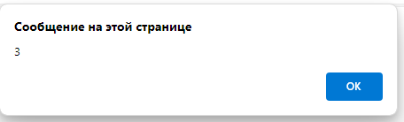
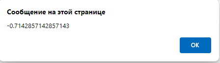
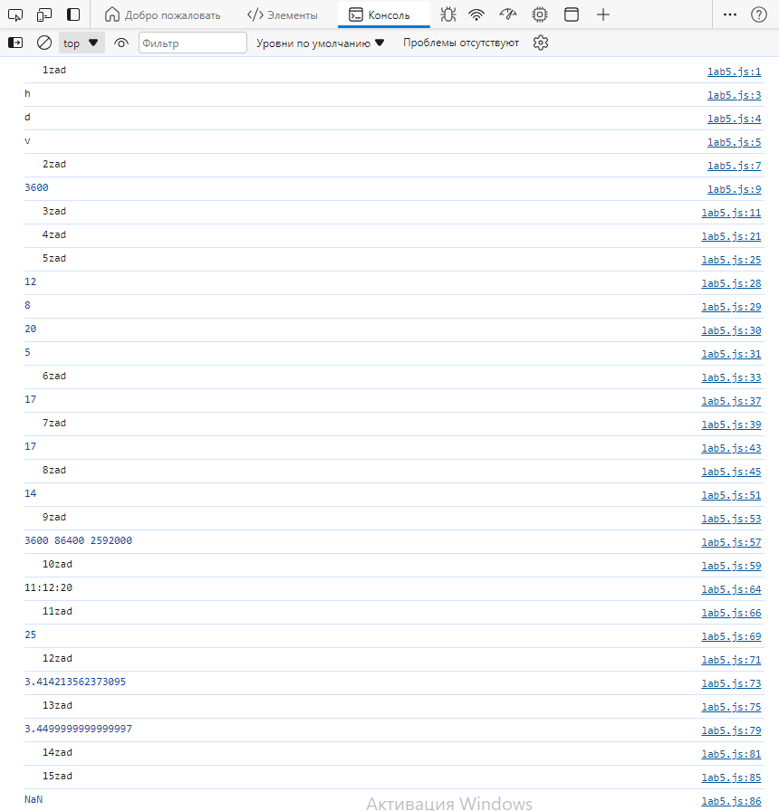

<p align="center">МИНИСТЕРСТВО НАУКИ И ВЫСШЕГО ОБРАЗОВАНИЯ<br>
РОССИЙСКОЙ ФЕДЕРАЦИИ<br> 
ФЕДЕРАЛЬНОЕ ГОСУДАРСТВЕННОЕ БЮДЖЕТНОЕ<br>
ОБРАЗОВАТЕЛЬНОЕ УЧРЕЖДЕНИЕ ВЫСШЕГО ОБРАЗОВАНИЯ<br>
«САХАЛИНСКИЙ ГОСУДАРСТВЕННЫЙ УНИВЕРСИТЕТ»</p>

<br><br><br><br><br>

<p align="center">
Институт естественных наук и техносферной безопасности<br>
Кафедра информатики<br>
Зыков Никита Евгеньевич</p>

<br><br><br>

<p align="center">
Лабораторная работа №5. «JS».<br>
01.03.02 Прикладная математика и информатика</p>

<br><br><br><br><br><br><br><br><br><br>

<p align="right">Научный руководитель<br>
Соболев Евгений Игоревич</p>

<br><br><br>

<p align="center">г. Южно-Сахалинск<br>
2024 г.</p>

<br><br><br><br><br><br><br><br><br><br>

# Введение

<b>HTML</b> — стандартизированный язык гипертекстовой разметки документов для просмотра веб-страниц в браузере. Веб-браузеры получают HTML документ от сервера по протоколам HTTP/HTTPS или открывают с локального диска, далее интерпретируют код в интерфейс, который будет отображаться на экране монитора.

<b>Visual Studio Code</b> — редактор исходного кода, разработанный Microsoft для Windows, Linux и macOS. Позиционируется как «лёгкий» редактор кода для кроссплатформенной разработки веб- и облачных приложений.

# Цели и задачи

1.	Создайте переменную str и присвойте ей значение 'hdfgv'. Обращаясь к отдельным символам этой строки выведите на экран символ 'h', символ 'd', символ 'v'.
2.	Напишите скрипт, который считает количество секунд в часе.
3.	Переделайте приведенный код так, чтобы в нем использовались операции +=, -=, *=, /=, ++, --. Количество строк кода при этом не должно измениться. Код для переделки:
var num = 1;
num = num + 12;
num = num - 14;
num = num * 5;
num = num / 7;
num = num + 1;
num = num - 1;
alert(num);

4.	Создайте переменную num и присвойте ей значение 3. Выведите значение этой переменной на экран с помощью метода alert.
5.	Создайте переменные a=10 и b=2. Выведите на экран их сумму, разность, произведение и частное (результат деления).
6.	Создайте переменные c=15 и d=2. Просуммируйте их, а результат присвойте переменной result. Выведите на экран значение переменной result.
7.	Создайте переменные a=10, b=2 и c=5. Выведите на экран их сумму.
8.	Создайте переменные a=17 и b=10. Отнимите от a переменную b и результат присвойте переменной c. Затем создайте переменную d, присвойте ей значение 7. Сложите переменные c и d, а результат запишите в переменную result. Выведите на экран значение переменной result.
9.	Напишите скрипт, который считает количество секунд в часе, в сутках, в месяце.
10.	Создайте три переменные - час, минута, секунда. С их помощью выведите текущее время в формате 'час:минута:секунда'.
11.	Создайте переменную, присвойте ей число. Возведите это число в квадрат. Выведите его на экран.
12.	Напишите однострочное решение, которое вычисляет сумму квадратных корней для всех чётных чисел целочисленного массива.
13.	Яблоко стоит 1.15, апельсин стоит 2.30. Сколько они стоят вместе – чему равна сумма 1.15 + 2.30 с точки зрения JavaScript?
14.	Какое будет выведено значение: let x = 5; alert(x++); ?
15.	Чему равно такое выражение: [ ] + false - null + true ?
16.	Что выведет этот код: let y = 1; let x = y = 2; console.log(x); ?
17.	Чему равна сумма [ ] + 1 + 2?
18.	Создайте переменные a6, a7, a8, a9, a10. Поместите в них результат выражений:
5 % 3,
3 % 5,
5 + '3',
'5' - 3,
75 + 'кг'
19.	Напишите скрипт, который находит площадь прямоугольника высота 23см. (в числовую переменную height), шириной 10см (в числовую переменную width), значение площади должно хранится в числовой переменной s.
20.	Напиши скрипт, который находит объем цилиндра высотой 10м (переменная heightC) и диаметром основания 4м (dC), результат поместите в переменную v.
21.	Даны размер ипотечного кредита (S — 2 млн.руб), процентная ставка (p  — 10%), кол-во лет (years — 5). Найти переплату по кредиту, значение переплаты должно содержаться в переменной perepl.
22.	Определите переменные str, num, flag и txt со значениями «Привет», 123, true, «true». При помощи оператора определения типа убедитесь, что переменных принадлежат типам: string, number, boolean.
23.	Дано число, необходимо вернуть противоположное число.

https://www.codewars.com/kata/56530b444e831334c0000020
https://www.codewars.com/kata/583710ccaa6717322c000105
https://www.codewars.com/kata/5a805d8cafa10f8b930005ba
https://www.codewars.com/kata/5763bb0af716cad8fb000580
https://www.codewars.com/kata/578a8a01e9fd1549e50001f1
https://www.codewars.com/kata/57eae20f5500ad98e50002c5

# Решение

Для выполнения этой лабораторной работы, я пользовался:<br>
•	Материалом в сети интернет;
<h2 align = "center">l5.html</h2>

```html

<!DOCTYPE html>
<html lang="en">
<head>
    <meta charset="UTF-8">
    <meta name="viewport" content="width=device-width, initial-scale=1.0">
    <title>Document</title>
</head>
<body>
    <script src="lab5.js"></script>
</body>
</html>

```

<h2 align = "center">lab5.js</h2>

```js

console.log("   1zad");
let str = 'hdfgv';
console.log(str[0]); 
console.log(str[1]);
console.log(str[4]); 

console.log("   2zad");
let secondsInHour = 60 * 60;
console.log(secondsInHour);

console.log("   3zad");
let num = 1;
num += 12;
num -= 14;
num *= 5;
num /= 7;
num++;
num--;
alert(num);

console.log("   4zad");
num = 3;
alert(num);

console.log("   5zad");
let a = 10;
let b = 2;
console.log(a + b); 
console.log(a - b); 
console.log(a * b); 
console.log(a / b); 

console.log("   6zad");
let c = 15;
let d = 2;
let result = c + d;
console.log(result);

console.log("   7zad");
a = 10;
b = 2;
c = 5;
console.log(a + b + c); 

console.log("   8zad");
a = 17;
b = 10;
c = a - b;
d = 7;
result = c + d;
console.log(result);

console.log("   9zad");
secondsInHour = 60 * 60;
const secondsInDay = secondsInHour * 24;
const secondsInMonth = secondsInDay * 30; 
console.log(secondsInHour, secondsInDay, secondsInMonth);

console.log("   10zad");
let currentDate = new Date();
let hour = currentDate.getHours();
let minute = currentDate.getMinutes();
let second = currentDate.getSeconds();
console.log(`${hour}:${minute}:${second}`);

console.log("   11zad");
let number = 5;
let square = number ** 2;
console.log(square);

console.log("   12zad");
let sum = [1, 2, 3, 4, 5].reduce((acc, val) => val % 2 === 0 ? acc + Math.sqrt(val) : acc, 0);
console.log(sum);

console.log("   13zad");
let applePrice = 1.15;
let orangePrice = 2.30;
let totalPrice = applePrice + orangePrice;
console.log(totalPrice);

console.log("   14zad");
let x = 5;
alert(x++); // Выведет 5

console.log("   15zad");
console.log([] + false - null + true); // Вернет NaN

console.log("   16zad");
let y = 1;
x = y = 2;
console.log(x); 

console.log("   17zad");
console.log([] + 1 + 2); 

console.log("   18zad");
let a6 = 5 % 3; 
let a7 = 3 % 5; 
let a8 = 5 + '3'; 
let a9 = '5' - 3; 
let a10 = 75 + 'кг'; 
console.log(a6);
console.log(a7);
console.log(a8);
console.log(a9);
console.log(a10);

console.log("   19zad");
let height = 23;
let width = 10;
let s = height * width;
console.log(s);

console.log("   20zad");
let heightC = 10;
let dC = 4;
let r = dC / 2;
let v = Math.PI * r * r * heightC;
console.log(v);

console.log("   21zad");
let S = 2000000;
let p = 0.1;
let years = 5;
let perepl = S * p * years;
console.log(perepl);

console.log("   22zad");
str = 'Привет';
num = 123;
let flag = true;
let txt = 'true';
console.log(typeof str); 
console.log(typeof num); 
console.log(typeof flag); 

console.log("   23zad");
function oppositeNumber(number) {
    return -number;
}
console.log(oppositeNumber(78)); 

```

# Результат








# Вывод

Была выполнена лабораторная работа №5