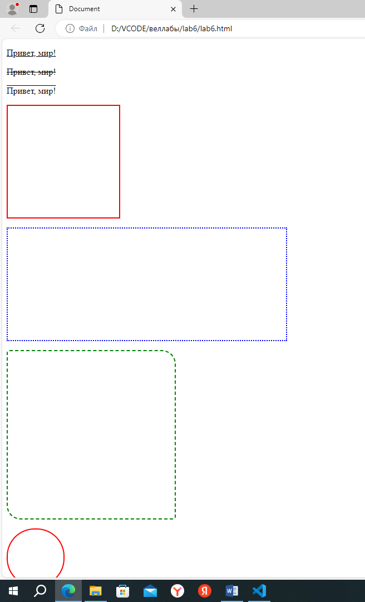
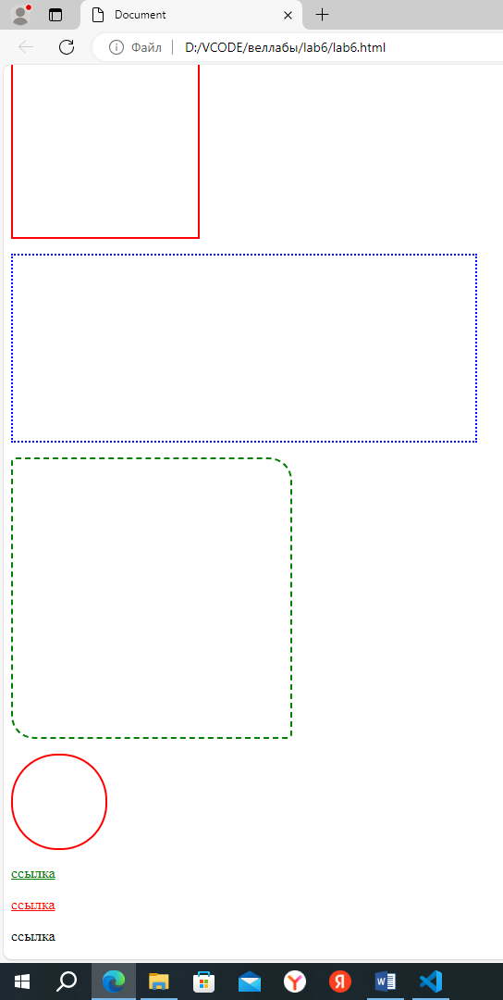
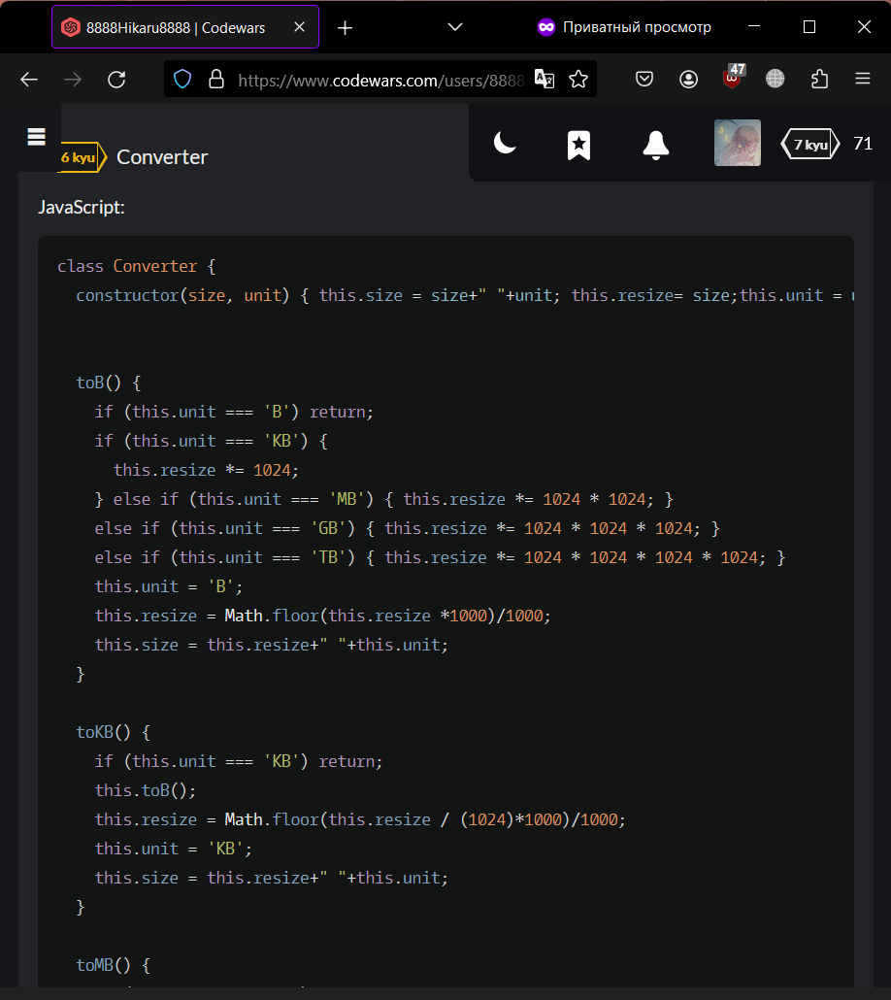
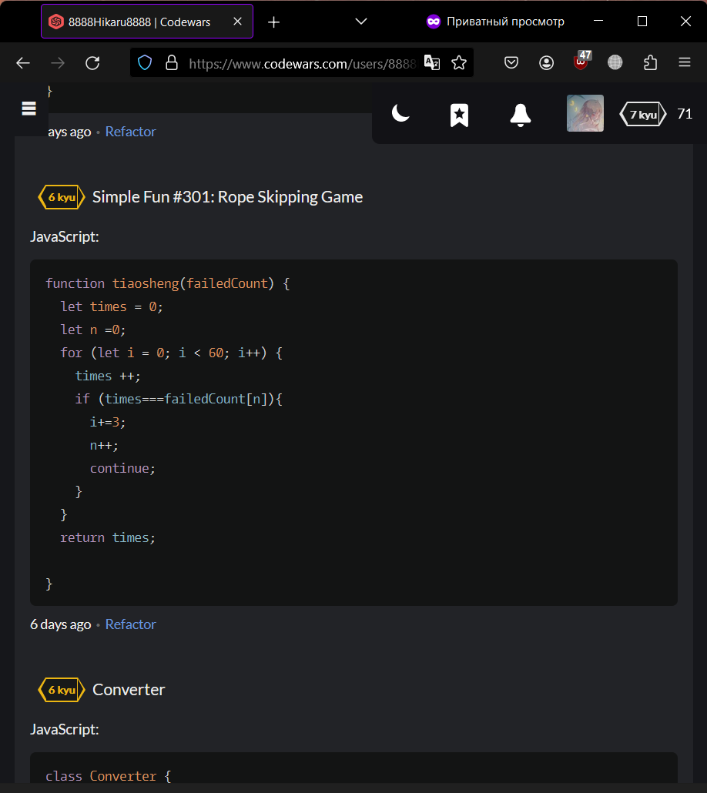
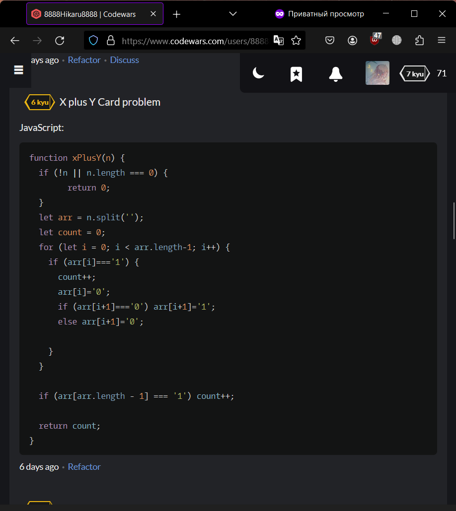
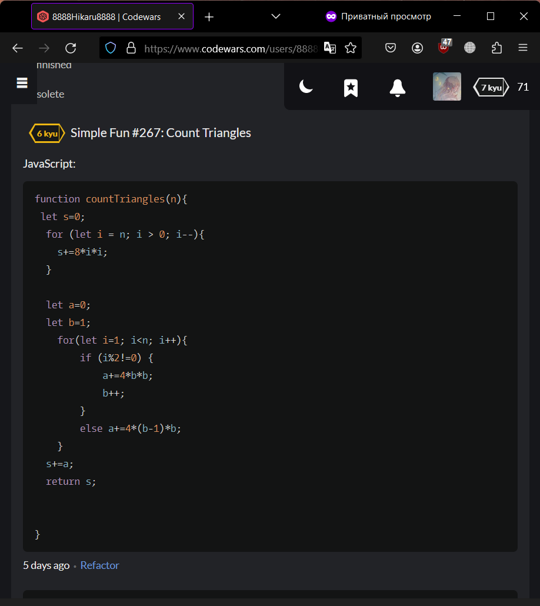

<p align="center">МИНИСТЕРСТВО НАУКИ И ВЫСШЕГО ОБРАЗОВАНИЯ<br>
РОССИЙСКОЙ ФЕДЕРАЦИИ<br> 
ФЕДЕРАЛЬНОЕ ГОСУДАРСТВЕННОЕ БЮДЖЕТНОЕ<br>
ОБРАЗОВАТЕЛЬНОЕ УЧРЕЖДЕНИЕ ВЫСШЕГО ОБРАЗОВАНИЯ<br>
«САХАЛИНСКИЙ ГОСУДАРСТВЕННЫЙ УНИВЕРСИТЕТ»</p>

<br><br><br><br><br>

<p align="center">
Институт естественных наук и техносферной безопасности<br>
Кафедра информатики<br>
Зыков Никита Евгеньевич</p>

<br><br><br>

<p align="center">
Лабораторная работа №6. «CSS».<br>
01.03.02 Прикладная математика и информатика</p>

<br><br><br><br><br><br><br><br><br><br>

<p align="right">Научный руководитель<br>
Соболев Евгений Игоревич</p>

<br><br><br>

<p align="center">г. Южно-Сахалинск<br>
2024 г.</p>

<br><br><br><br><br><br><br><br><br><br>

# Введение

<b>HTML</b> — стандартизированный язык гипертекстовой разметки документов для просмотра веб-страниц в браузере. Веб-браузеры получают HTML документ от сервера по протоколам HTTP/HTTPS или открывают с локального диска, далее интерпретируют код в интерфейс, который будет отображаться на экране монитора.

<b>Visual Studio Code</b> — редактор исходного кода, разработанный Microsoft для Windows, Linux и macOS. Позиционируется как «лёгкий» редактор кода для кроссплатформенной разработки веб- и облачных приложений.

# Цели и задачи
1.	Придумайте селектор, который выберет абзацы <p> внутри дивов <div>.
2.	Придумайте селектор, который выберет все <h2> внутри дивов <div>.
3.	Придумайте селектор, который выберет все абзацы <p> из элемента с id=test.
4.	Придумайте селектор, который выберет все <h2> из элемента с id=test.
5.	Выберите все элементы с классом bbb.
6.	Выберите все элементы с классом bbb из элемента с id=test.
7.	Выберите все абзацы <p> с классом bbb.
8.	Выберите все <h2> с классом bbb.
9.	Выберите все абзацы <p> с классом bbb из элемента с id=test.
10.	Выберите все элементы с классом bbb и элементы с классом xxx одновременно.
11.	Выберите все абзацы <p> с классом bbb и <h2> с классом xxx одновременно.
12.	Выберите все абзацы <p> с классом bbb из id=test и все абзацы <p> с классом xxx из id=test одновременно.
13.	Выберите все элементы из класса fff.
14.	Выберите все абзацы <p> из класса fff.
15.	Выберите все абзацы <p> с классом fff.
16.	Выберите все элементы с классом bbb из класса fff.
17.	Выберите все <h2> с классом bbb из класса fff.
18.	Сделайте селектор, который выберет все ссылки из id=test, с состояния link и visited сделайте неподчеркнутыми и красными, а состояние hover - подчеркнутым и голубым.
19.	 Сделайте селектор, который выберет все ссылки с классом www, состояния link и visited сделайте подчеркнутыми и голубыми, а состояние hover - неподчеркнутым.
20.	 Сделайте селектор, который выберет все ссылки из id=test с классом www. Цвета состояний выберите самостоятельно.
21.	 Сделайте селектор, который выберет все ссылки из class=eee с классом www. Цвета состояний выберите самостоятельно.
22.	Повторите страницу по данному по образцу:
23.	Повторите страницу по данному по образцу:
24.	Повторите страницу по данному по образцу:
25.	Повторите страницу по данному по образцу:
26.	Повторите страницу по данному по образцу:
27.	Повторите страницу по данному по образцу:
https://www.codewars.com/kata/555de49a04b7d1c13c00000e
https://www.codewars.com/kata/588453ea56daa4af920000ca
https://www.codewars.com/kata/55e9529cbdc3b29d8c000016
https://www.codewars.com/kata/55968ab32cf633c3f8000008
https://www.codewars.com/kata/55ee3ebff71e82a30000006a
https://www.codewars.com/kata/5412509bd436bd33920011bc

# Решение

Для выполнения этой лабораторной работы, я пользовался:<br>
•	Материалом в сети интернет;
<h2 align = "center">lab6.html</h2>

```html

<!DOCTYPE html>
<html lang="en">
<head>
    <meta charset="UTF-8">
    <meta name="viewport" content="width=device-width, initial-scale=1.0">
    <title>Document</title>
    <style>
        #p1{
            text-decoration-line:underline;
        }
        #p2{
            text-decoration-line:line-through;
        }
        #p3{
            text-decoration-line:overline;
        }
        #box1 {
            width: 200px;
            height: 200px;
            border: 2px solid red; 
        }
        #box2 {
            width: 500px;
            height: 200px;
            border: 2px dotted blue; 
        }
        #box3 {
            width: 300px;
            height: 300px;
            border: 2px dashed green; 
            border-radius: 5px 25px 5px 25px;
        }
        #box4 {
            width: 100px;
            height: 100px;
            border: 2px solid red; 
            border-radius: 50px;
        }
        #h1{
            text-decoration-line:underline;
            color: green;
        }
        #h2{
            text-decoration-line:underline;
            color: red;
        }
        #h3{
            text-decoration-line:none;
            color: black;
        }

    </style>
</head>
<body>
    <p id="p1">Привет, мир!</p>
    <p id="p2">Привет, мир!</p>
    <p id="p3">Привет, мир!</p>

    <div id="box1"></div>
    <p></p>
    <div id="box2"></div>
    <p></p>
    <div id="box3"></div>
    <p></p>
    <div id="box4"></div>
    <p></p>
    <p id="h1">ссылка</p>
    <p id="h2">ссылка</p>
    <p id="h3">ссылка</p>
</body>
</html>

```

<h2 align = "center">l6.css</h2>

```css

/*1*/
div p
/*2*/
div h2
/*3*/
#test p
/*4*/
#test h2
/*5*/
.bbb
/*6*/
#test .bbb
/*7*/
p.bbb
/*8*/
h2.bbb
/*9*/
#test .bbb
/*10*/
.bbb, .xxx
/*11*/
p.bbb, h2.xxx
/*12*/
#test p.bbb, #test p.xxx
/*13*/
.fff
/*14*/
p.fff
/*15*/
p.fff
/*16*/
.fff .bbb
/*17*/
.fff h2.bbb
/*18*/
#test a:link, #test a:visited { text-decoration: none; color: red; } #test a:hover { text-decoration: underline; color: blue; }
/*19*/
a.www:link, a.www:visited { text-decoration: underline; color: blue; } a.www:hover { text-decoration: none; }
/*20*/
#test a.www { color: aliceblue; }
/*21*/
.eee a.www { color: aquamarine;}

```

# Результат







# Вывод

Была выполнена лабораторная работа №6