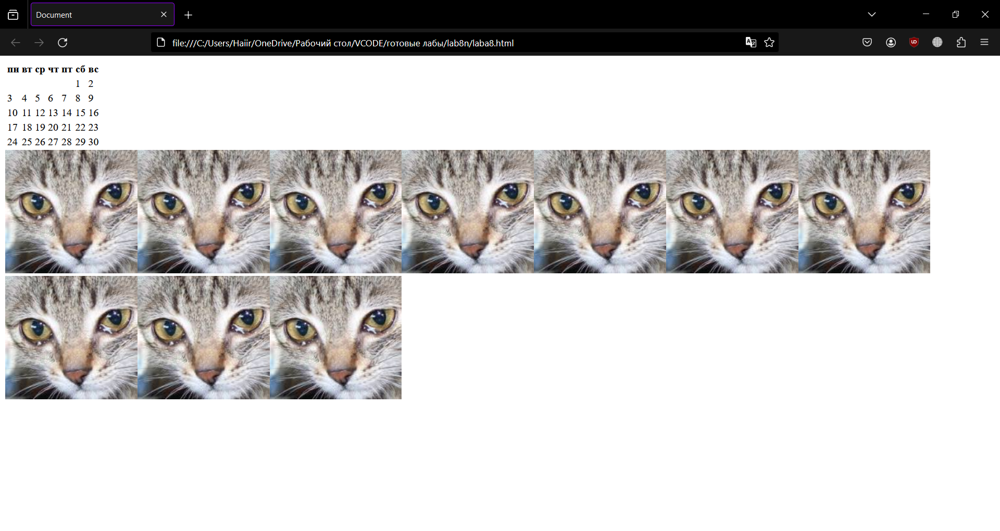
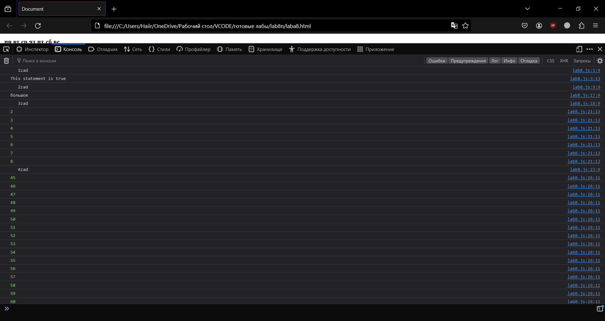
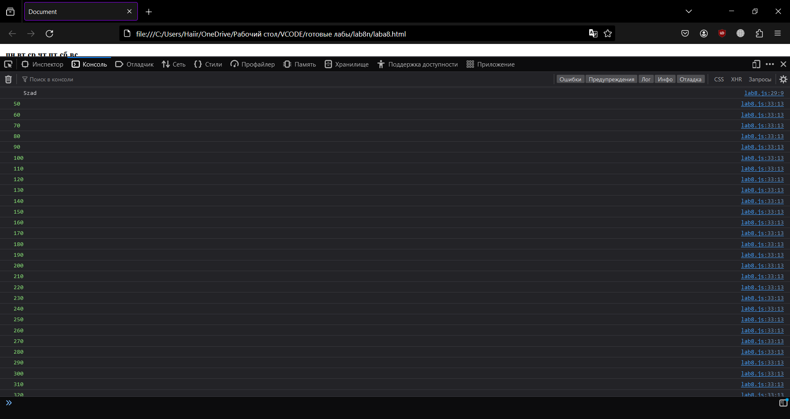
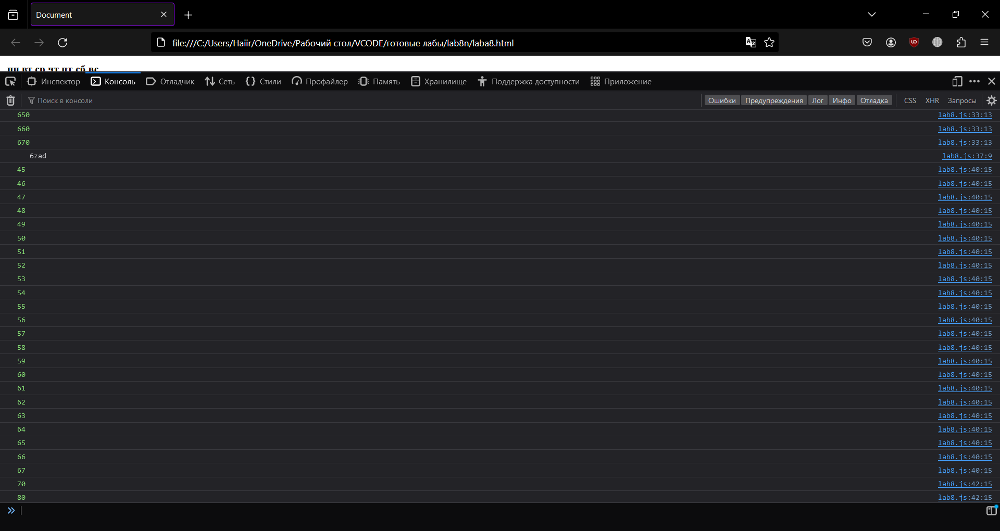
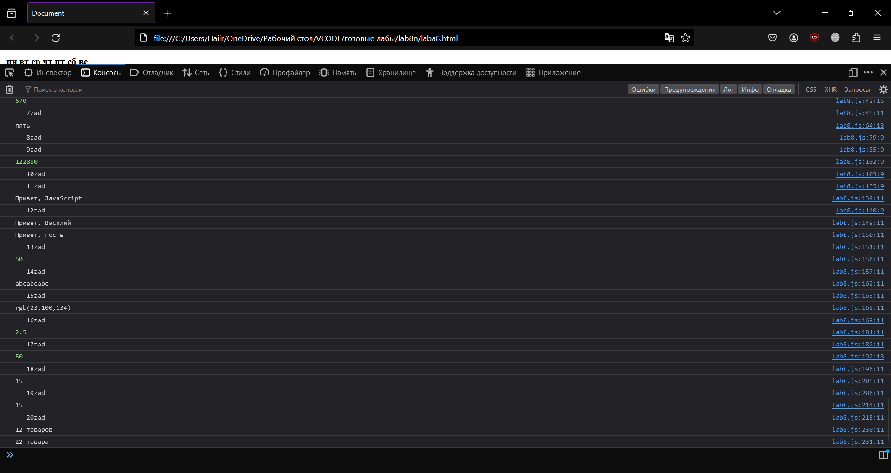
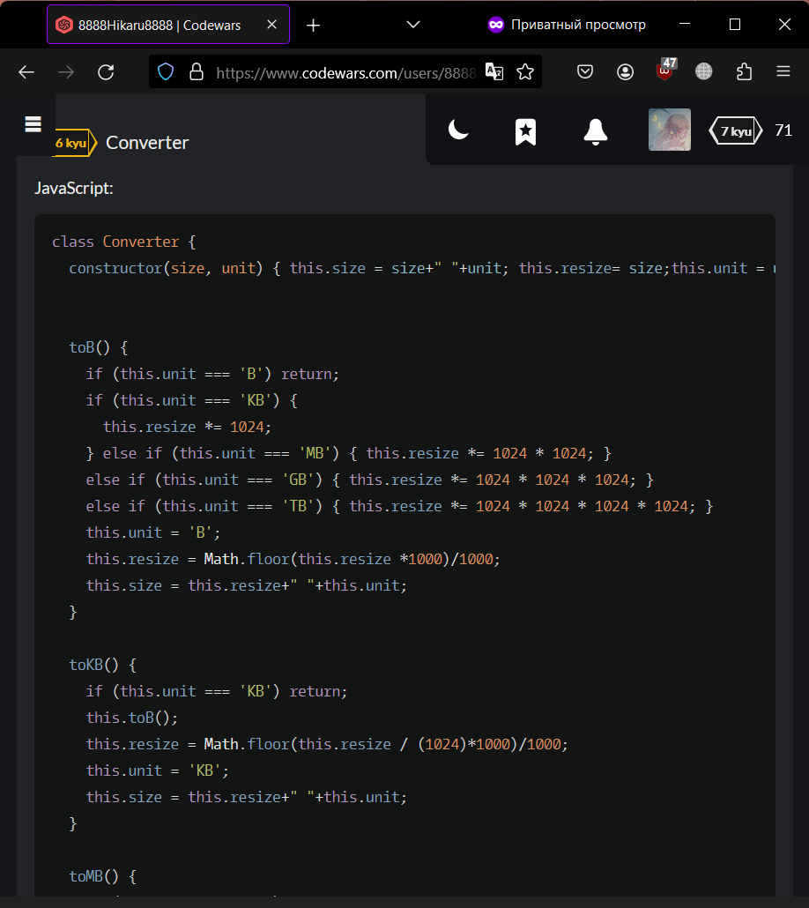
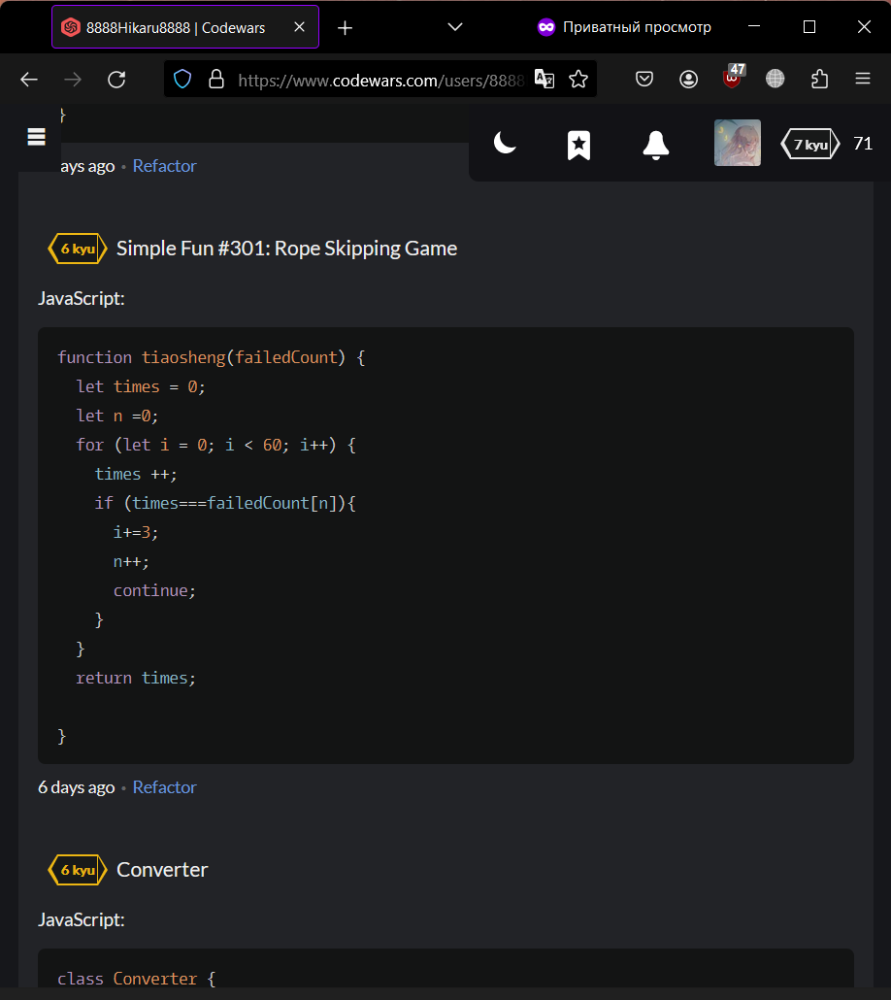
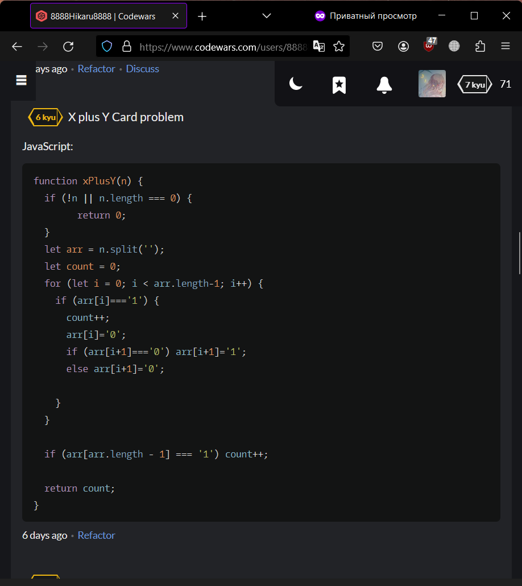
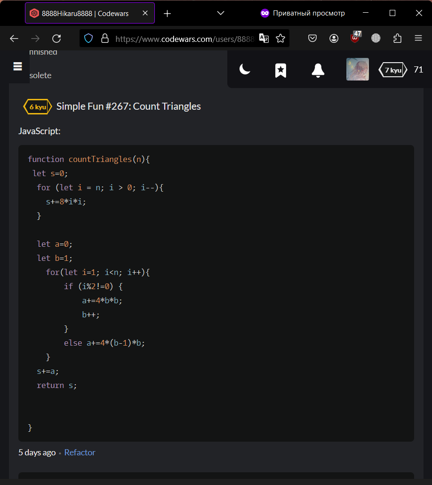

<p align="center">МИНИСТЕРСТВО НАУКИ И ВЫСШЕГО ОБРАЗОВАНИЯ<br>
РОССИЙСКОЙ ФЕДЕРАЦИИ<br> 
ФЕДЕРАЛЬНОЕ ГОСУДАРСТВЕННОЕ БЮДЖЕТНОЕ<br>
ОБРАЗОВАТЕЛЬНОЕ УЧРЕЖДЕНИЕ ВЫСШЕГО ОБРАЗОВАНИЯ<br>
«САХАЛИНСКИЙ ГОСУДАРСТВЕННЫЙ УНИВЕРСИТЕТ»</p>

<br><br><br><br><br>

<p align="center">
Институт естественных наук и техносферной безопасности<br>
Кафедра информатики<br>
Зыков Никита Евгеньевич</p>

<br><br><br>

<p align="center">
Лабораторная работа №8. «JavaScript».<br>
01.03.02 Прикладная математика и информатика</p>

<br><br><br><br><br><br><br><br><br><br>

<p align="right">Научный руководитель<br>
Соболев Евгений Игоревич</p>

<br><br><br>

<p align="center">г. Южно-Сахалинск<br>
2024 г.</p>

<br><br><br><br><br><br><br><br><br><br>

# Введение

<b>HTML</b> — стандартизированный язык гипертекстовой разметки документов для просмотра веб-страниц в браузере. Веб-браузеры получают HTML документ от сервера по протоколам HTTP/HTTPS или открывают с локального диска, далее интерпретируют код в интерфейс, который будет отображаться на экране монитора.

<b>Visual Studio Code</b> — редактор исходного кода, разработанный Microsoft для Windows, Linux и macOS. Позиционируется как «лёгкий» редактор кода для кроссплатформенной разработки веб- и облачных приложений.

# Цели и задачи

1.	Напишите оператор if, такой, чтобы в качестве выражения в скобках у него были значения true, false (Например, if( true ) или if( false )). Посмотрите как работает этот оператор, поместив какую-нибудь команду после круглых скобок (Например, console.log(1)). 

2.	Создайте переменные m и n. В m поместите произвольное числовое значение. Напишите оператор ветвления if так, чтобы если m было больше 50, то в переменную n помещалось слово «большое», иначе — слово «маленькое».

3.	Определите сколько раз выполнится цикл while? Примечание: это можно сделать прочитав скрипт или запустив его консоли браузера.
var i = 2;
while( i < 9 ){
 	  console.log( i++ );
  }


4.	Напишите скрипт, который используя оператор while выведет все числа от 45 до 67.

5.	Напишите скрипт, который используя оператор while выведет все числа от 45 до 670, кратные 10.

6.	Напишите скрипт, который используя оператор for выполнит два предыдущих задания.

7.	Переменная n хранит целое число от 0 до 9. Используя оператор switch, написать скрипт, который в зависимости от числа будет выводить слово (Например, если n равно 3, то будет выводиться слово «три»)
var n = 5;
switch( n ){
 //Напишите тут свой код
}

8.	Используя document.write() и любую из циклических конструкций выведите  десять одинаковых изображений (надо выводить )

9.	В переменных size и unit хранятся размер и единицы измерения информации 120 и «Кб» соответственно. Зная что могут быть заданные Кб, Мб, Гб (кило-, мега- и гигабайты) и 1килобайт равен 1024 байта, найти количество байт в size.

10.	Постройте при помощи циклов JavaScript скрипт для календаря на HTML. Примечание: выполнить задание для одного месяца, используя HTML-элемент table

11.	Напишите функцию hello1(), которая при вызове будет возвращать строку «Привет, JavaScript!».

12.	Напишите функцию hello2(), которая при вызове будет принимать переменную name (например, «Василий») и выводить строку (в нашем случае «Привет, Василий»).  В случае отсутствующего аргумента выводить «Привет, гость»

13.	Напишите функцию mul(n,m), которая принимает два аргумента и возвращает произведение этих аргументов. Проверьте ее работу.


14.	Создайте функцию repeat(str, n), которая возвращает строку, состоящую и n повторений строки str. n — по умолчанию 2, str — пустая строка

15.	Создайте функцию rgb(), которая будет принимать три числовых аргумента и возвращать строку вида «rgb(23,100,134)». Если аргументы не заданы, считать их равными нулю. Не проверять переменные на тип данных

16.	Создайте функцию avg() , которая будет находить среднее значение по всем своим аргументам (аргументы величины числовые).

17.	Создайте функцию m(a,b) оболочку для mul(). m() должна принимать два аргумента а возвращать результат работы mul() с этими двумя аргументами После выполнения задания поэкспериментируйте, создайте функцию log(), которая будет принимать одно значение, а вызывать  console.log() с этим значением.

18.	Напишите функцию operation(m,n,o), в которой m и n — числовые переменные, а o — функциональный литерал, который берет два аргумента и выполняет математическую операцию над ними 


19.	Напишите функцию addN(n), которая вернёт другую функцию. Возвращенная функция должна складывать получаемый аргумент с аргументом n возвращающей функции. 

20.	Напишите функцию words(),  которая в зависимости от переданного в нее целочисленного аргумента n, будет выводить слово «товар» в нужно форме («12 товаров», но «22 товара»). По умолчанию аргумент d должен иметь значение 0

https://www.codewars.com/kata/596fd97f65ad2fc072000037
https://www.codewars.com/kata/5925138effaed0de490000cf
https://www.codewars.com/kata/59269e371a640c0e98000085
https://www.codewars.com/kata/5913ffb2cb1475215c000039


# Решение

Для выполнения этой лабораторной работы, я пользовался:<br>
•	Материалом в сети интернет;
<h2 align = "center">lab8.html</h2>

```html

<!DOCTYPE html>
<html lang="en">
<head>
    <meta charset="UTF-8">
    <meta name="viewport" content="width=device-width, initial-scale=1.0">
    <title>Document</title>
</head>
<body>
    <div id="calendar"></div>
    <script src="lab8.js"></script>
    
</body>
</html>

```

<h2 align = "center">lab8.js</h2>

```js

console.log("   1zad");
if( true ) {
    console.log("This statement is true");
}
  
if( false ) {
    console.log("This statement is false");
}
console.log("   2zad");
let ma = 60;
let n;
if(ma > 50) {
  n = "большое";
} else {
  n = "маленькое";
}
console.log(n);
console.log("   3zad");
var i = 2;
while( i < 9 ){
 	  console.log( i++ );
}
console.log("   4zad");
i = 45;
while(i <= 67) {
  console.log(i);
  i++;
}
console.log("   5zad");
i = 45;
while(i <= 670) {
  if(i % 10 === 0) {
    console.log(i);
  }
  i++;
}
console.log("   6zad");
for(let i = 45; i <= 670; i++) {
    if(i <= 67) {
      console.log(i);
    } else if(i % 10 === 0) {
      console.log(i);
    }
  }
  console.log("   7zad");
n = 5;
switch(n) {
  case 0:
    console.log("ноль");
    break;
  case 1:
    console.log("один");
    break;
  case 2:
    console.log("два");
    break;
  case 3:
    console.log("три");
    break;
  case 4:
    console.log("четыре");
    break;
  case 5:
    console.log("пять");
    break;
  case 6:
    console.log("шесть");
    break;
  case 7:
    console.log("семь");
    break;
  case 8:
    console.log("восемь");
    break;
  case 9:
    console.log("девять");
    break;
}
console.log("   8zad");
let img = "";

for(let i = 0; i < 10; i++) {
  document.write(img);
}
console.log("   9zad");
let size = 120;
let unit = "Кб";

let bytes;
switch(unit) {
  case "Кб":
    bytes = size * 1024;
    break;
  case "Мб":
    bytes = size * 1024 * 1024;
    break;
  case "Гб":
    bytes = size * 1024 * 1024 * 1024;
    break;
}

console.log(bytes);
console.log("   10zad");

function createCalendar(elem, year, month) {
  let cur_date = new Date(year, month - 1, 1);      
  let fin_date = new Date(year, month, 0);          

  while ( cur_date.getDay() != 1 ) {                
      cur_date.setDate(cur_date.getDate() - 1);     
  }

  let table = document.createElement("table");     
  table.innerHTML = "<tr><th>пн</th><th>вт</th><th>ср</th>" +
                    "<th>чт</th><th>пт</th><th>сб</th><th>вс</th></tr>";

  while ( cur_date <= fin_date ) {                 
      let tr = document.createElement("tr");
      for (let i = 0; i < 7; i++) {                 
          let td = document.createElement("td");
          if ( cur_date.getMonth() == month - 1 ) { 
              td.textContent = cur_date.getDate(); 
          }
          tr.append(td);
          cur_date.setDate(cur_date.getDate() + 1); 
      }
      table.append(tr);
  }

  elem.append(table);     
}                         
createCalendar(calendar, 2024, 6);


console.log("   11zad");
function hello1() {
    return "Привет, JavaScript!";
  }
  console.log(hello1());
console.log("   12zad");
function hello2(name) {
    if(name) {
      return "Привет, " + name;
    } else {
      return "Привет, гость";
    }
  }
  
  console.log(hello2("Василий"));
  console.log(hello2());
  console.log("   13zad");
function mul(n, m) {
    return n * m;
  }
  
  console.log(mul(5, 10)); 
  console.log("   14zad");
function repeat(str, n = 2) {
    return str.repeat(n);
  }
  
  console.log(repeat("abc", 3)); 
  console.log("   15zad");
function rgb(r = 0, g = 0, b = 0) {
    return `rgb(${r},${g},${b})`;
  }
  
  console.log(rgb(23, 100, 134)); 
  console.log("   16zad");
function avg() {
    let sum = 0;
    let count = arguments.length;
    
    for(let i = 0; i < count; i++) {
      sum += arguments[i];
    }
    
    return sum / count;
  }
  
  console.log(avg(1, 2, 3, 4)); 
  console.log("   17zad");
function mul(n, m) {
    return n * m;
  }
  
  function m(a, b) {
    return mul(a, b);
  }
  
  function log(value) {
    console.log(value);
  }
  
  log(m(5, 10)); 
  console.log("   18zad");
function operation(m, n, o) {
    return o(m, n);
  }
  
  function add(a, b) {
    return a + b;
  }
  
  console.log(operation(5, 10, add)); 
  console.log("   19zad");
function addN(n) {
    return function(x) {
      return n + x;
    };
  }
  
  let add5 = addN(5);
  console.log(add5(10)); 
  console.log("   20zad");
function words(n, d = 0) {
    if(n % 100 >= 11 && n % 100 <= 19) {
      return "товаров";
    }
  
    if(n % 10 === 1) {
      return "товар";
    } else if(n % 10 >= 2 && n % 10 <= 4) {
      return "товара";
    } else {
      return "товаров";
    }
  }
  
  console.log("12 " + words(12)); 
  console.log("22 " + words(22)); 
  

```

# Результат










# Вывод

Была выполнена лабораторная работа №8