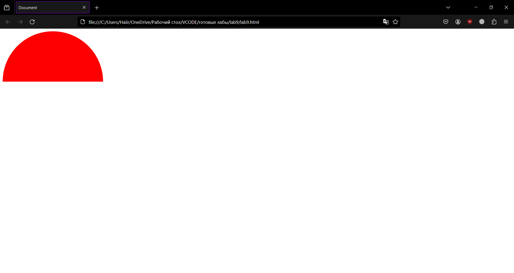
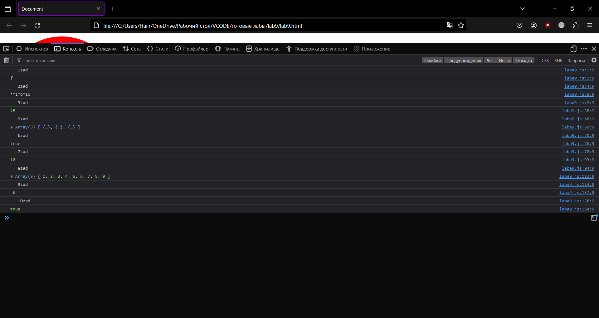

<p align="center">МИНИСТЕРСТВО НАУКИ И ВЫСШЕГО ОБРАЗОВАНИЯ<br>
РОССИЙСКОЙ ФЕДЕРАЦИИ<br> 
ФЕДЕРАЛЬНОЕ ГОСУДАРСТВЕННОЕ БЮДЖЕТНОЕ<br>
ОБРАЗОВАТЕЛЬНОЕ УЧРЕЖДЕНИЕ ВЫСШЕГО ОБРАЗОВАНИЯ<br>
«САХАЛИНСКИЙ ГОСУДАРСТВЕННЫЙ УНИВЕРСИТЕТ»</p>

<br><br><br><br><br>

<p align="center">
Институт естественных наук и техносферной безопасности<br>
Кафедра информатики<br>
Зыков Никита Евгеньевич</p>

<br><br><br>

<p align="center">
Лабораторная работа №9. «JavaScript».<br>
01.03.02 Прикладная математика и информатика</p>

<br><br><br><br><br><br><br><br><br><br>

<p align="right">Научный руководитель<br>
Соболев Евгений Игоревич</p>

<br><br><br>

<p align="center">г. Южно-Сахалинск<br>
2024 г.</p>

<br><br><br><br><br><br><br><br><br><br>

# Введение

<b>HTML</b> — стандартизированный язык гипертекстовой разметки документов для просмотра веб-страниц в браузере. Веб-браузеры получают HTML документ от сервера по протоколам HTTP/HTTPS или открывают с локального диска, далее интерпретируют код в интерфейс, который будет отображаться на экране монитора.

<b>Visual Studio Code</b> — редактор исходного кода, разработанный Microsoft для Windows, Linux и macOS. Позиционируется как «лёгкий» редактор кода для кроссплатформенной разработки веб- и облачных приложений.

# Цели и задачи

1.	Есть некоторая строка (var str = 'fgfggg';), что будет, если мы возьмем str[0]?
2.	 Дана функция, она принимает в качестве аргументов строки '*', '1', 'b', '1c', реализуйте ее так, что бы она вернула строку '1*b*1c'
3.	Дано дерево, надо найти сумму всех вершин.
4.	Нарисовать стилями полукруг.
5.	Есть массив в котором лежат объекты с датами, отсортировать по датам.
6.	Есть несколько слов, определить состоят ли они из одних и тех же букв('кот', 'ток', 'окт')
7.	От них же. Числа от 1 до 100 лежат в массиве, они хаотично перемешанные, от туда изъяли одно число, надо найти, что это за число. алгоритм не должен превышать O(n^2) сложности.
8.	Реализовать сортировку пузырьком.
9.	Обратная польская нотация.
10.	Реализовать функцию является ли слово палендром.


# Решение

Для выполнения этой лабораторной работы, я пользовался:<br>
•	Материалом в сети интернет;
<h2 align = "center">lab9.html</h2>

```html

<!DOCTYPE html>
<html lang="en">
<head>
    <meta charset="UTF-8">
    <meta name="viewport" content="width=device-width, initial-scale=1.0">
    <title>Document</title>
    <style>
        .semicircle {
            width: 300px;
            height: 150px;
            background-color: red;
            border-top-left-radius: 150px 150px;
            border-top-right-radius: 150px 150px;
        }
    </style>
</head>
<body>
    <div class="semicircle"></div>
    <script src="laba9.js"></script>
</body>
</html>

```

<h2 align = "center">laba9.js</h2>

```js

console.log("   1zad");
var str = 'fgfggg';
console.log(str[0]);
console.log("   2zad");
function concatenateStrings(...args) {
    return args.filter(str => typeof str === 'string').join(args[0]);
}
console.log(concatenateStrings('*', '1', 'b', '1c'));
console.log("   3zad");
function findSumOfVertices(root) {
  let sum = 0;

  function dfs(node) {
    if (node === null) {
      return;
    }

    sum += node.value;
    dfs(node.left);
    dfs(node.right);
  }

  dfs(root);

  return sum;
}

const root = {
  value: 1,
  left: {
    value: 2,
    left: {
      value: 4,
      left: null,
      right: null,
    },
    right: {
      value: 5,
      left: null,
      right: null,
    },
  },
  right: {
    value: 3,
    left: {
      value: 6,
      left: null,
      right: null,
    },
    right: {
      value: 7,
      left: null,
      right: null,
    },
  },
};

console.log(findSumOfVertices(root)); 

console.log("   5zad");
const array = [
  { date: new Date('2022-01-01') },
  { date: new Date('2021-12-31') },
  { date: new Date('2022-02-01') },
];

array.sort((a, b) => a.date - b.date);

console.log(array);
console.log("   6zad");
function areAnagrams(...words) {
    const sortedWords = words.map(word => word.split('').sort().join(''));
    return new Set(sortedWords).size === 1;
}
  
console.log(areAnagrams('кот', 'ток', 'окт')); 

console.log("   7zad");
function findMissingNumber(array) {
  let sum = 0;
  let expectedSum = (100 * 101) / 2; 

  for (let i = 0; i < array.length; i++) {
    sum += array[i];
  }

  const missingNumber = expectedSum - sum;
  return missingNumber;
}

const array1 = [1, 2, 3, 4, 5, 6, 7, 8, 9, 11, 12, 13, 14, 15, 16, 17, 18, 19, 20, 21, 22, 23, 24, 25, 26, 27, 28, 29, 30, 31, 32, 33, 34, 35, 36, 37, 38, 39, 40, 41, 42, 43, 44, 45, 46, 47, 48, 49, 50, 51, 52, 53, 54, 55, 56, 57, 58, 59, 60, 61, 62, 63, 64, 65, 66, 67, 68, 69, 70, 71, 72, 73, 74, 75, 76, 77, 78, 79, 80, 81, 82, 83, 84, 85, 86, 87, 88, 89, 90, 91, 92, 93, 94, 95, 96, 97, 98, 99, 100];

console.log(findMissingNumber(array1)); 
console.log("   8zad");
function bubbleSort(array) {
  const n = array.length;

  for (let i = 0; i < n - 1; i++) {
    for (let j = 0; j < n - i - 1; j++) {
      if (array[j] > array[j + 1]) {
        const temp = array[j];
        array[j] = array[j + 1];
        array[j + 1] = temp;
      }
    }
  }

  return array;
}

const array2 = [5, 3, 8, 4, 2, 1, 9, 6, 7];

console.log(bubbleSort(array2)); 
console.log("   9zad");
function evaluateRPN(tokens) {
  const stack = [];

  for (let i = 0; i < tokens.length; i++) {
    const token = tokens[i];

    if (isOperator(token)) {
      const operand2 = stack.pop();
      const operand1 = stack.pop();

      const result = performOperation(token, operand1, operand2);
      stack.push(result);
    } else {
      stack.push(parseFloat(token));
    }
  }

  return stack.pop();
}

function isOperator(token) {
  const operators = ['+', '-', '*', '/'];
  return operators.includes(token);
}

function performOperation(operator, operand1, operand2) {
  switch (operator) {
    case '+':
      return operand1 + operand2;
    case '-':
      return operand1 - operand2;
    case '*':
      return operand1 * operand2;
    case '/':
      return operand1 / operand2;
    default:
      throw new Error('Invalid operator');
  }
}

const expression = ['4', '9', '-', '7', '*', '5', '+','5', '/'];

console.log(evaluateRPN(expression));
console.log("   10zad");
function isPalindrome(word) {
    const reversedWord = word.split('').reverse().join('');
    return word === reversedWord;
}
  
console.log(isPalindrome('radar')); 

```

# Результат



# Вывод

Была выполнена лабораторная работа №9