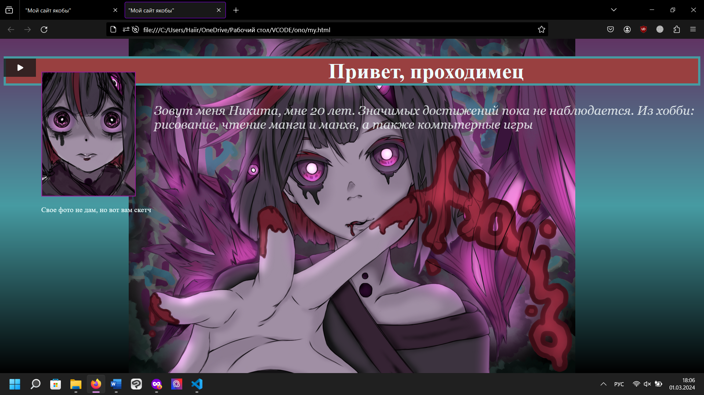

<p align="center"> МИНИСТЕРСТВО НАУКИ И ВЫСШЕГО ОБРАЗОВАНИЯ
РОССИЙСКОЙ ФЕДЕРАЦИИ
ФЕДЕРАЛЬНОЕ ГОСУДАРСТВЕННОЕ БЮДЖЕТНОЕ
ОБРАЗОВАТЕЛЬНОЕ УЧРЕЖДЕНИЕ ВЫСШЕГО ОБРАЗОВАНИЯ
«САХАЛИНСКИЙ ГОСУДАРСТВЕННЫЙ УНИВЕРСИТЕТ»

Институт естественных наук и техносферной безопасности
Кафедра информатики
Зыков Никита Евгеньевич

Лабораторная работа №1. «Введение в вэб-разработку»
01.03.02 Прикладная математика и информатика </p>

<p align="right"> Научный руководитель
Соболев Евгений Игоревич </p>

<p align="center"> г. Южно-Сахалинск
2024 г. </p>

# Введение

HTML — стандартизированный язык гипертекстовой разметки документов для просмотра веб-страниц в браузере. Веб-браузеры получают HTML документ от сервера по протоколам HTTP/HTTPS или открывают с локального диска, далее интерпретируют код в интерфейс, который будет отображаться на экране монитора.

Visual Studio Code — редактор исходного кода, разработанный Microsoft для Windows, Linux и macOS. Позиционируется как «лёгкий» редактор кода для кроссплатформенной разработки веб- и облачных приложений.

# Цели и задачи

Требуется создать страницу о себе.

# Решение

Для выполнения этой лабораторной работы, я пользовался:
•	Материалом в сети интернет;
```
<!DOCTYPE html>
<html lang="ru">
<head>
    <meta charset="UTF-8">
    <meta name="viewport" content="width=device-width, initial-scale=1.0">
    <title>"Мой сайт якобы"</title>
    <link rel="stylesheet" href="https://www.w3schools.com/htmls/styles">
    <style>
    section h1 {
        font-size: calc(1rem + 2vw);
    }
    section p {
        font-size: calc(12px + 1vw);
        font-family: Georgia, 'Times New Roman', Times, serif;
    }
    /*body { 
     
       
   }*/
    html {
       /* background: linear-gradient(#603463, #000000) fixed;*/
        background-image: url(IMG_0248.PNG) , linear-gradient(#603463, #469ba2, #000000);
        background-repeat: no-repeat;
        background-position: center center;
        background-attachment: fixed;
        -webkit-background-size: cover;
        -moz-background-size: cover;
        -o-background-size: cover;
        background-size: contain;
    }
    
    .rightpic {
        float: right;
        margin: 0 0 5px 5px; 
    }
    
   .sign {
    float: left; /* Выравнивание по правому краю */
    padding: 7px; /* Поля внутри блока */
    margin: 10px 0 5px 5px; /* Отступы вокруг */
   }
   .sign figcaption {
    margin: 0 auto 5px; /* Отступы вокруг абзаца */
    color: azure;
   }
  
    </style>
    <!--<bgsound src="vnezapnyiy-horror.mp3" loop="1"></bgsound>-->
    <embed src="vnezapnyiy-horror.mp3" width="70" height="45" align="left" hidden="False" autostart="True" loop="True"></embed>
</head>
<body>
    <!--<a href="htttps://ya.ru" target="blank">visit</a>style.css webP-->
    <figure class="sign">
        <p></p>
        <figcaption>Свое фото не дам, но вот вам скетч</figcaption>
    </figure>
    <section>
        
        <!---->
        
        
        <h1 align="center" style="background-color: rgb(153, 64, 64); color: azure; border: 5px solid #469ba2">Привет, проходимец</h1>
        <p style="font-style: italic; color: rgba(248, 255, 254, 0.8);">
            Зовут меня Никита, мне 20 лет. Значимых достижений пока не наблюдается. 
            Из хобби: рисование, чтение манги и манхв, а также компьтерные игры
        </p>
        
        <!-- -->
        <!-- <small>hhgkhfkghkf</small>
        <sub>HHUGGUGfff</sub>
        <sup>hgfhgHHHkfgfg</sup>
        <strong>hhjjj</strong>
        <em>hiihi</em>-->
       
        <h3></h3>
        <h4></h4>
        <h5></h5>
    </section>
    
    
</body>
    
</html>                
```
# Результат



# Вывод

По итогу проделанной лабораторной работы, я познакомился с базовыми функциями языка html и научился использовать их в своём сайте.


